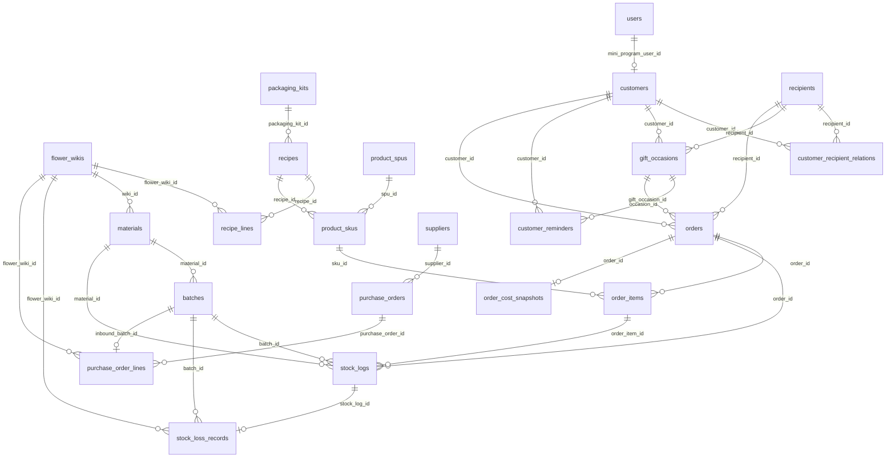

# Flower WMS System — 架构说明

> 文档版本：基于当前代码库静态审计更新。
> 应用根目录：`flower-wms-system/`。物理表名以 `prisma/schema.prisma` 的 `@@map(...)` 为准。
> 本文只描述当前代码真实存在的模型、服务、API、页面和脚本。

---

## 1. 项目技术全景定位

Flower WMS System 是 Universe42 / 万物肆贰鲜花的鲜花行业 **WMS + CMS + 微信小程序 API** 平台，技术栈为：

| 层级 | 当前实现 |
|---|---|
| Web | Next.js 16 App Router |
| UI | React 19 + Tailwind CSS 4 |
| ORM | Prisma 7，client 输出到 `src/generated/prisma` |
| DB | PostgreSQL（`DateTime` 按 UTC / ISO 存储） |
| 后台展示时区 | `Asia/Shanghai`（UTC+8）；统一使用 `src/lib/datetime.ts` |
| Auth | Auth.js / next-auth v5 beta，后台 StaffUser RBAC |
| 小程序 | 仓库根目录 `42_mp/` |
| 部署 | Dockerfile + docker-compose，Next standalone，cron worker |

当前已实现能力：

- WMS 花材母表、标准配方、包装方案、物理批次库存、手工入库、指定批次报损、销售 FIFO、退款回库。
- CMS 商品 SPU/SKU、商品分类、轮播、营销配置、SKU 绑定 Recipe、SKU 毛利预估展示。
- 微信小程序用户登录、商品浏览、购物车、下单、mock 支付、订单查询。
- 小程序订单驱动 CRM：`Customer` / `Recipient` / `GiftOccasion` / `CustomerReminder`；常用收花人 API；后台 CRM 基础 API；支付成功后客户统计与复购提醒生成。
- WMS CRM 客户看板：`/wms/crm` 总览、客户列表 / 详情、复购提醒看板。
- 小程序下单礼赠信息：`buyerInfo` / `recipientInfo` / `giftOccasion` / `reminderOptions`；常用收花人选择 / 保存。
- CMS 商品适用礼赠场景标签：`ProductSpu.occasionTags`。
- CMS 商品运营标签增强：`colorTags` / `styleTags` / `relationshipTags` / `budgetTags` / `positioningTags` / `sellingPoints` / `operationNote`。
- 商品上架校验：`validateProductPublishReadiness` 纯函数 + CMS API，只提示不自动上下架。
- CMS 推荐位配置：`CmsRecommendationSlot` / `CmsRecommendationItem`，人工配置小程序首页与场景推荐。
- 小程序商品接口返回运营标签（key + label）；`operationNote` 不返回前台。
- 小程序推荐位 API：`GET /api/miniprogram/recommendations`。
- CMS 商品运营标签编辑 UI、上架校验提示、小程序展示预览。
- CMS 推荐位配置页面 `/cms/recommendations`。
- 小程序首页 / 场景推荐位展示、商品卡片运营标签展示。
- **Sprint 10 礼赠购买体验**：首页场景化购买入口（CMS 可配置 + 本地 fallback 6 大场景 + 图标）、CMS 推荐位驱动主推 / 场景 / 新品 / 高客单、`HIGH_TICKET` 区块、品牌说明区。
- **CMS 首页场景入口配置**（`CmsHomeSceneEntry`）：`/cms/marketing`「首页场景入口」Tab；与推荐位商品配置边界分离。
- 小程序首页动态读取 `GET /api/miniprogram/home-scene-entries`；CMS 无 active 配置时使用默认 6 个 fallback。
- 场景入口点击后进入选花 tab（`pages/category/category`）；因 tabBar 页须 `wx.switchTab`，筛选参数经 `category_pending_nav` storage 传递，选花页 `onShow` 消费后请求服务端 tag 过滤。
- 商品列表标签筛选（场景 / 预算 / 色系 / 风格 / 关系；**服务端 tag 过滤后分页**，`GET /api/miniprogram/products`）。
- **API 目录治理**：小程序业务数据统一 `/api/miniprogram/*`；`/api/wechat/*` 仅登录/授权/支付回调。
- 选花页筛选条件 chips、上拉加载更多、场景上下文文案。
- 常用收花人独立管理（含生日 / 纪念日）；个人中心「重要日期」入口。
- 配送时段「傍晚」与花材微调说明统一文案。
- 商品详情礼赠表达模块（适合场景 / 对象 / 情绪故事 / 花材微调说明 / 配送说明）。
- 商品详情「立即预订」直跳下单；下单页礼赠字段三层（必填 / 建议 / 可展开）。
- 常用收花人：下单页选择回填、个人中心「我的收花人」列表 / 新增 / 编辑 / 删除（对接 POST/PATCH/DELETE recipients API）。
- 配送时间选择提示（当日单 / 节日高峰 / 特殊时段）。
- 小程序图标体系统一：**Lucide Icons** 风格 PNG（`42_mp/scripts/export-lucide-icons.mjs` 导出）；资源在 `42_mp/miniprogram/assets/icons/`；页面通过 `utils/icons.ts` + `mp-icon` 引用；禁止 Python 自绘正式 UI 图标；缺失 fallback。
- 订单真实毛利核算：`OrderCostSnapshot`。
- 产品级毛利预估：`FlowerWiki.standardUnitCost` + `Recipe` + `PackagingKit` + SKU price。
- 经营报表中心：销售、趋势、毛利排行、低毛利、成本结构、花材使用、损耗、库存预警、采购复盘与供应商分析。
- 供应商与采购单：`Supplier` / `PurchaseOrder` / `PurchaseOrderLine`。
- 采购单到货入库：生成 `Batch` + `StockLog: INBOUND`，回写 `PurchaseOrderLine.inboundBatchId`。
- 采购复盘：供应商采购排行、花材采购价趋势、批次销售转化、批次销售成本贡献、采购建议标签。
- 产品决策中心：产品健康状态、损耗敏感度、建议售价、决策标签、成本结构风险；WMS 报表 Tab + CMS 商品页提示。

### 当前不存在 / 不应假设存在

| 能力 | 当前状态 |
|---|---|
| 多租户 SaaS | 未实现；无 `tenantId` 或租户隔离模型 |
| 正式微信支付 | 未实现；`mock-pay` 可用，`callback` 是占位链路 |
| 聚合配送 / 第三方配送 | 未实现 |
| 对象存储 | 未实现；上传写本地 `public/uploads` |
| Redis / MQ | 未实现；`package.json` 无相关依赖 |
| 包装物理库存扣减 | 未实现；`PackagingKit` 只代表标准包装成本 |
| 供应商付款 / 对账 / 发票 | 未实现 |
| Excel 导入导出 | 未实现 |
| CRM 自动触达 / 会员积分 / 复杂分群 | 未实现 |
| 优惠券 / 拼团秒杀 / A/B 测试 | 未实现 |
| 自动推荐算法 / 自动上下架 / 自动改价 | 未实现 |
| 微信订阅消息 / 短信自动发送 | 未实现 |
| SaaS 计费 | 未实现 |

历史命名对照：

```text
stock_batches（不存在）     -> batches
product_bom（已废弃）       -> recipes + recipe_lines + product_skus.recipe_id
product_spus.recipe_id      -> 已删除；配方绑定在 product_skus.recipe_id
```

---

## 2. 目录结构与模块边界

```text
flower-wms-system/
├── prisma/
│   ├── schema.prisma
│   └── migrations/
├── scripts/
│   ├── cron-inventory-daemon.ts
│   ├── smoke-purchase-flow.ts
│   ├── smoke-purchase-analytics.ts
│   ├── smoke-product-decision.ts
│   └── sync-physical-to-virtual-stock.ts
├── src/
│   ├── app/
│   │   ├── api/
│   │   ├── cms/
│   │   ├── wms/
│   │   └── admin/
│   ├── components/
│   ├── generated/prisma/
│   ├── lib/
│   ├── services/
│   └── utils/
└── package.json
```

### 关键 service

| 文件 | 职责 |
|---|---|
| `src/services/purchase-pure.ts` | 采购成本纯计算、附加费用分摊 |
| `src/services/purchase.ts` | 供应商 CRUD、采购单 CRUD、取消、入库、标准成本更新 |
| `src/services/order-cost-pure.ts` | 订单成本纯计算 |
| `src/services/order-cost.ts` | `OrderCostSnapshot` 计算、查询、重算 |
| `src/services/product-margin-pure.ts` | 产品毛利预估纯计算 |
| `src/services/product-margin.ts` | SKU / SPU 毛利预估服务 |
| `src/services/business-report-pure.ts` | 报表纯函数 |
| `src/services/business-report.ts` | 经营报表与缺失快照 backfill |
| `src/services/purchase-analytics-pure.ts` | 采购复盘纯计算：summary、供应商排行、花材价趋势、批次转化、成本贡献、建议标签 |
| `src/services/purchase-analytics.ts` | 采购复盘 Prisma 查询与 API DTO 序列化 |
| `src/services/product-decision-pure.ts` | 产品决策纯规则：健康状态、损耗敏感度、建议售价、决策标签、成本结构风险 |
| `src/services/product-decision.ts` | 产品决策 Prisma 聚合：SKU 销售、三档毛利、订单分摊实际毛利、Dashboard DTO |
| `src/lib/datetime.ts` | 后台统一时区格式化与报表日期 UTC 边界转换 |
| `src/lib/product-decision-tags.ts` | 产品决策标签 / 健康状态 / 损耗敏感度前端映射 |
| `src/services/order-fifo.ts` | 支付后 FIFO 扣物理库存并生成订单成本快照 |
| `src/services/fifo.ts` | FIFO 扣减算法与 StockLog 写入 |
| `src/services/wms-stock.ts` | 手工入库、指定批次报损、批次流水线 |
| `src/services/inventory-sync.ts` | 物理库存向 SKU 虚拟库存投影 |
| `src/services/recipe.ts` | Recipe / RecipeLine CRUD 和 BOM 编号 |
| `src/services/wiki.ts` | FlowerWiki CRUD 和检索 |
| `src/services/crm-pure.ts` | CRM 纯函数：手机号规范化、客户统计、提醒日期与文案 |
| `src/services/crm.ts` | CRM Prisma 服务：订单沉淀、客户/收花人/礼赠/提醒 CRUD |
| `src/lib/cms-product-tags.ts` | CMS 商品运营标签 key / label 常量与解析 |
| `src/services/cms-product-validation-pure.ts` | 商品上架校验纯函数（不访问 DB） |
| `src/services/cms-product-operations.ts` | 商品运营画像、上架校验、推荐位 CRUD、小程序推荐位查询 |
| `src/services/miniprogram-product-filter-pure.ts` | 小程序商品 tag / 价格 / 排序 / 分页纯函数 |
| `src/services/miniprogram-products.ts` | 小程序商品列表 Prisma 查询 + service 层 tag 过滤后分页 |

当前代码未发现独立 `src/services/supplier.ts`；供应商 service 逻辑在 `src/services/purchase.ts`。

---

## 3. WMS 页面路由

| 路径 | 组件 / 职责 |
|---|---|
| `/wms` | redirect 到 `/wms/dashboard` |
| `/wms/dashboard` | WMS 仪表盘 |
| `/wms/inventory` | 物理库存列表，仅展示有可用批次的 Material |
| `/wms/inventory/[id]` | 原材料详情：批次、库存流水、历史报损 |
| `/wms/operations` | 仓储日常：手工入库、报损、批次流水线 |
| `/wms/purchase-orders` | 采购单管理：列表、详情、编辑、取消、到货入库、标准成本更新 |
| `/wms/suppliers` | 供应商管理 |
| `/wms/wiki` | FlowerWiki 母表 |
| `/wms/recipes` | 标准配方研发中心 |
| `/wms/packaging-kits` | 包装方案管理 |
| `/wms/material-categories` | 原材料分类 |
| `/wms/orders` | 订单履约看板 |
| `/wms/reports` | 经营报表中心（Tab：经营总览、销售趋势、商品毛利、库存预警、损耗模型影响、采购复盘、产品决策） |
| `/wms/crm` | 客户 CRM 总览：指标卡、今日 / 未来 7 天提醒、最近客户 |
| `/wms/crm/customers` | CRM 客户列表 |
| `/wms/crm/customers/[id]` | CRM 客户详情：收花人、礼赠历史、提醒、订单 |
| `/wms/crm/reminders` | CRM 复购提醒看板 |
| `/wms/batches` | redirect 到 `/wms/operations` |
| `/wms/wastage` | redirect 到 `/wms/operations?panel=loss` |
| `/wms/bom` | redirect 到 `/wms/recipes` |

导航定义：`src/components/wms/sidebar.tsx`。

---

## 4. CMS 页面路由

| 路径 | 职责 |
|---|---|
| `/cms/products` | 商品列表，展示 SKU 毛利预估与产品决策健康状态 / 关键标签 |
| `/cms/products/[id]` | 商品编辑，SKU 绑定 Recipe，展示毛利预估、产品决策建议与 warning |
| `/cms/product-categories` | 商城商品分类树 |
| `/cms/banner` | 首页轮播 |
| `/cms/marketing` | 营销配置（公告 / 弹窗 + **首页场景入口** Tab） |
| `/cms/recommendations` | 推荐位配置（首页与场景推荐） |
| `/cms/carousel` | redirect 到 `/cms/banner` |
| `/cms/categories` | redirect 到 `/cms/product-categories` |

CMS 商品编辑边界：

- CMS 可以维护 SPU/SKU、价格、图文、商品分类、轮播与营销配置。
- SKU 通过 `ProductSku.recipeId` 只读绑定 WMS Recipe。
- CMS 不维护 RecipeLine 明细，不直接修改库存。
- `PATCH /api/cms/skus/[id]` 只允许图文白名单字段，防止 mass assignment。
- CMS 商品列表 / 编辑页展示产品决策标签和建议，仅作为经营参考；不会自动改价、上下架或修改配方。
- CMS 商品编辑页可配置 `ProductSpu.occasionTags`（适用礼赠场景）；列表展示场景标签；用于 CRM 复购推荐参考，不自动上下架。
- 商品编辑（`PUT /api/cms/products/[id]`）支持运营标签白名单字段：`occasionTags`、`colorTags`、`styleTags`、`relationshipTags`、`budgetTags`、`positioningTags`、`sellingPoints`、`operationNote`。
- 商品上架前可通过 `GET /api/admin/cms/products/[id]/publish-readiness` 校验信息完整性、毛利风险、产品决策风险；只提示，不自动改状态。
- 推荐位配置（`/cms/recommendations`、`/api/admin/cms/recommendation-slots`）用于小程序首页与场景**商品**推荐；人工配置，非自动推荐算法。
- **首页场景入口**（`/cms/marketing` 首页场景入口 Tab、`/api/admin/cms/home-scene-entries`）决定小程序首页展示哪些送花场景卡片；与推荐位商品配置不得混为一谈。
- 商品列表（`/cms/products`）通过 `operation-summaries` API 展示运营标签、上架校验状态、产品决策摘要、推荐位状态，并支持场景 / 定位 / 校验状态筛选。
- 商品编辑页含「商品运营标签」「上架校验」「小程序展示预览」区块。

### CMS 易用性增强（运营配置无需手填内部 ID）

CMS 面向花店运营用户，主界面不要求理解 `productId` / `skuId` / `recipeId` / `categoryId` 等数据库标识：

| 能力 | 实现 |
|---|---|
| 商品 / SKU / 配方 / 分类 / 推荐位 | 通过 `src/components/cms/pickers/` 下选择器配置，内部仍保存 id/key |
| 推荐位 key / 营销 key | 默认由 `src/lib/cms-auto-key.ts` 自动生成；手动编辑仅在「高级设置」 |
| Banner / 营销跳转 | `CmsLinkTargetSelector`（`src/lib/cms-link-target.ts`）按目标类型选择商品、分类、场景、推荐位或自定义链接 |
| 运营标签 | `ProductOperationTagsEditor` 中文 pill 多选，内部保存稳定英文 key |
| 旧数据 | 无法解析的 `linkUrl` / 已删除关联对象显示「关联对象不存在或已删除」，页面不崩溃 |

轻量选择器 API：

| 方法 | 路径 |
|---|---|
| GET | `/api/admin/cms/products/search?keyword=` |
| GET | `/api/admin/cms/products/[id]/skus` |
| GET | `/api/admin/wms/recipes/search?keyword=` |
| GET | `/api/admin/cms/recommendation-slots?lite=true` |

### CMS 经营红线（易用性）

- CMS 主界面不得要求运营用户手填 `productId` / `skuId` / `recipeId` / `categoryId`。
- 自定义 key 必须校验格式（小写字母、数字、下划线、短横线）与唯一性；冲突提示：「该 key 已被使用，请更换。」
- 小程序跳转配置优先使用目标类型 + 目标对象，不鼓励直接写路径；自定义链接须显式 warning。
- 旧 Banner `linkUrl` / `targetParam`、旧推荐位 key 必须兼容，不能因历史数据导致 CMS 崩溃。

---

## 5. 后台 API 边界

### WMS 采购与供应商

| 方法 | 路径 |
|---|---|
| GET / POST | `/api/admin/wms/suppliers` |
| GET / PUT / DELETE | `/api/admin/wms/suppliers/[id]` |
| GET / POST | `/api/admin/wms/purchase-orders` |
| GET / PUT | `/api/admin/wms/purchase-orders/[id]` |
| POST | `/api/admin/wms/purchase-orders/[id]/cancel` |
| POST | `/api/admin/wms/purchase-orders/[id]/receive` |
| POST | `/api/admin/wms/purchase-orders/calculate-preview` |
| POST | `/api/admin/wms/purchase-orders/lines/[lineId]/update-standard-cost` |
| POST | `/api/admin/wms/purchase-orders/[id]/update-standard-costs` |

### WMS 其他

| 路径 | 说明 |
|---|---|
| `/api/admin/wms/recipes`、`/[id]` | 配方 CRUD |
| `/api/admin/wms/packaging-kits`、`/[id]` | 包装方案 CRUD / 停用 |
| `/api/admin/wms/stock-in` | 手工入库 |
| `/api/admin/wms/stock-loss` | 指定批次报损 |
| `/api/admin/wms/stock-batches` | 按 FlowerWiki 查可用批次 |
| `/api/admin/wms/stock-loss/history` | 报损历史 |
| `/api/admin/wms/stock-pipeline` | 在库批次流水线 |
| `/api/admin/wms/material-categories`、`/[id]` | 原材料分类 |
| `/api/admin/wms/bom` | 410，旧 BOM API 已迁移至 recipes |

### 成本 / 报表 / 商品预估

| 路径 | 说明 |
|---|---|
| `GET /api/admin/orders/[id]/cost` | 订单成本详情 |
| `POST /api/admin/orders/[id]/cost/recalculate` | 重算成本快照 |
| `PATCH /api/admin/orders/[id]/delivery-cost` | 写实际配送成本并重算 |
| `GET /api/admin/products/[id]/margin-estimate` | 商品毛利预估 |
| `POST /api/admin/products/[id]/margin-estimate/recalculate` | 重新计算商品毛利预估 |
| `GET /api/admin/cms/skus/[id]/margin-estimate` | SKU 毛利预估 |
| `GET /api/admin/cms/products/[id]/operation-profile` | 商品运营画像（标签、毛利、产品决策、推荐位、上架校验） |
| `GET /api/admin/cms/products/[id]/publish-readiness` | 商品上架校验结果 |
| `GET /api/admin/cms/products/operation-summaries` | 商品运营摘要列表 |
| `GET /api/admin/cms/products/search` | 商品选择器轻量搜索 |
| `GET /api/admin/cms/products/[id]/skus` | 商品 SKU 选择器列表 |
| `GET /api/admin/wms/recipes/search` | 配方选择器轻量搜索 |
| `GET/POST /api/admin/cms/recommendation-slots` | 推荐位列表 / 创建（`?lite=true` 返回轻量列表） |
| `GET/PATCH/DELETE /api/admin/cms/recommendation-slots/[id]` | 推荐位详情 / 更新 / 停用 |
| `POST /api/admin/cms/recommendation-slots/[id]/items` | 添加推荐商品（返回 warnings + publishReadiness） |
| `PATCH/DELETE /api/admin/cms/recommendation-items/[itemId]` | 更新 / 移除推荐项 |
| `/api/admin/reports/*` | 经营报表中心 API |

报表 API：

- `dashboard`
- `business-summary`
- `daily-sales`
- `product-profit-ranking`
- `low-margin-orders`
- `cost-structure`
- `material-usage`
- `wastage`
- `inventory-alerts`
- `loss-model-impact`
- `purchase-analytics`
- `product-decisions`
- `product-decisions/[skuId]`
- `backfill-cost-snapshots`

权限：

- 后台 API 使用 `src/lib/api-auth.ts` 的 `requirePermission`。
- `IT_ADMIN` 不能访问业务数据。
- `wms:write`：`STORE_ADMIN` / `WAREHOUSE_MANAGER`。
- `orders:write`：`STORE_ADMIN` / `FLORIST`。
- `business:read` / `business:write` 用于成本与报表相关接口。

### CRM（后台）

| 方法 | 路径 | 说明 |
|---|---|---|
| GET | `/api/admin/crm/summary` | CRM 总览指标与今日 / 7 天提醒摘要 |
| GET | `/api/admin/crm/recommendations` | 按礼赠场景匹配商品推荐（结合产品决策健康状态） |
| GET | `/api/admin/crm/customers` | 客户列表（keyword / source / minOrders / page） |
| GET | `/api/admin/crm/customers/[id]` | 客户详情 |
| GET | `/api/admin/crm/recipients` | 收花人列表 |
| GET | `/api/admin/crm/reminders` | 复购提醒列表（status / type / customerId / 日期范围） |
| PATCH | `/api/admin/crm/reminders/[id]` | 更新提醒状态（DONE / SNOOZED / CANCELLED / PENDING） |

权限：`business:read` 查询；`business:write` 更新提醒。

### 小程序常用收花人

| 方法 | 路径 | 说明 |
|---|---|---|
| GET | `/api/miniprogram/recipients` | 当前登录用户关联 Customer 的常用收花人 |
| POST | `/api/miniprogram/recipients` | 创建常用收花人 |
| PATCH | `/api/miniprogram/recipients/[id]` | 更新（`id` 为 `CustomerRecipientRelation.id`） |
| DELETE | `/api/miniprogram/recipients/[id]` | 软删除 relation（`isActive=false`），不删历史订单与礼赠记录 |

小程序下单 `POST /api/miniprogram/orders/create` 兼容旧 payload，并可选传入 `buyerInfo` / `recipientInfo` / `giftOccasion` / `reminderOptions` 礼赠 CRM 字段。

### 小程序业务 API（`/api/miniprogram/*`）

小程序前台业务数据**唯一**入口目录。前端 `42_mp/miniprogram/utils/request.ts` 基址为 `/api/miniprogram`。

| 方法 | 路径 | 说明 |
|---|---|---|
| GET | `/api/miniprogram/products`、`/api/miniprogram/products/[id]` | 商品列表 / 详情；列表支持 tag / 价格 / 排序 / 分页；不含 `operationNote` |
| GET | `/api/miniprogram/product-categories` | 商品分类树 |
| GET | `/api/miniprogram/recommendations` | CMS 推荐位（`slotKey` / `sceneType` / `limit`） |
| GET | `/api/miniprogram/home-scene-entries` | 首页场景入口（CMS + fallback） |
| GET | `/api/miniprogram/homepage` | 首页聚合（Banner + 公告 + 弹窗 + 分类） |
| GET | `/api/miniprogram/home-banners` | 首页轮播 |
| GET/POST | `/api/miniprogram/cart` | 购物车校验 |
| GET | `/api/miniprogram/orders` | 订单列表 |
| POST | `/api/miniprogram/orders/create` | 创建订单 |
| POST | `/api/miniprogram/orders/mock-pay` | Mock 支付 |
| POST | `/api/miniprogram/orders/cancel` | 取消待支付订单 |
| POST | `/api/miniprogram/orders/confirm-receipt` | 确认收货 |
| GET/PATCH | `/api/miniprogram/user/profile` | 用户资料 |
| POST | `/api/miniprogram/upload` | 头像上传 |

### 微信平台 API（`/api/wechat/*`）

仅微信平台能力，**不承载**商品/订单/购物车等业务数据：

| 方法 | 路径 | 说明 |
|---|---|---|
| POST | `/api/wechat/auth/login` | 小程序登录（code2Session + JWT） |
| POST | `/api/wechat/login` | 重定向至 `auth/login`（deprecated） |
| POST | `/api/wechat/orders/callback` | 微信支付回调占位（未来正式支付） |

**CMS 首页场景入口 Admin API**（需 `cms:read` / `cms:write`）：

| 方法 | 路径 | 说明 |
|---|---|---|
| GET | `/api/admin/cms/home-scene-entries` | 列表（含 `fallbackEntries` / `warnings`） |
| POST | `/api/admin/cms/home-scene-entries` | 创建；`action: seed-defaults` 一键补全默认 6 个 |
| GET/PATCH/DELETE | `/api/admin/cms/home-scene-entries/[id]` | 详情 / 更新 / 删除 |
| POST | `/api/admin/cms/home-scene-entries/reorder` | 批量更新 `sortOrder` |

**商品列表 query（Sprint 10.2）**：`occasionTag` / `occasionTags`、`colorTag(s)`、`styleTag(s)`、`relationshipTag(s)`、`budgetTag(s)`、`positioningTag(s)`、`sceneType`、`minPrice`、`maxPrice`、`keyword`、`categoryId`（或 `category`）、`sort`（`default` | `newest` | `price_asc` | `price_desc` | `recommended`）、`page`、`pageSize`。过滤逻辑见 `src/services/miniprogram-product-filter-pure.ts` + `src/services/miniprogram-products.ts`（当前为 service 层 filter 后分页，商品量增大后可优化为 DB 层 JSON 查询）。

小程序行为补充：

- 小程序定位是**礼赠购买助手**，不是普通复杂电商平台；礼赠 CRM 字段用于沉淀，但下单页不得强制填写过多扩展字段。
- 首页并行加载 `homepage`、`products`、`recommendations`、**`home-scene-entries`**；各模块失败不白屏，场景入口失败时使用本地 fallback 6 个。
- 首页首屏：Banner →「你想把花送给谁？」→ **CMS 配置的场景入口**（带 `iconKey` 映射图标；CMS 无 active 时用 fallback）→ `HOME_MAIN` 主推 → 场景推荐 / 新品 / 高客单。
- 场景入口跳转（`utils/home-scene-entries.ts` → `navigateToSceneEntry`）：
  - `PRODUCT_FILTER` → `wx.switchTab` 到选花 tab，pending 携带 `sceneType` / `occasionTag`，服务端 tag 过滤；
  - `RECOMMENDATION_SLOT` → 同上，并携带 `slotKey`（选花页暂未用 slotKey 做 UI 筛选，但须跳转不静默）；
  - `CUSTOM_URL` → tabBar 页用 `switchTab`，普通页用 `navigateTo`；选花 tab 带 query 时解析为 pending 参数；
  - `targetType` 须为 enum key（`PRODUCT_FILTER` / `RECOMMENDATION_SLOT` / `CUSTOM_URL`），小程序端 `normalizeTargetType` 兼容旧中文/小写；
  - 跳转失败须 `console.error` + toast，不得静默。
- 选花页支持五维标签筛选（`occasionTag(s)` / `budgetTag(s)` / `colorTag(s)` / `styleTag(s)` / `relationshipTag(s)` / `sceneType` / `minPrice` / `maxPrice` / `sort` / `page` / `pageSize`）；**tag 过滤在 service 层于分页之前完成**，`pagination.total` 为过滤后总数。
- **小程序前端不得只对当前页数据做 tag 筛选**；筛选变化须重新请求服务端并重置 `page=1`。
- 商品列表 / 详情 / 推荐卡片展示场景、色系、风格、卖点标签；不展示 `operationNote`、成本、毛利、产品决策内部 warning。
- 商品详情含花材微调说明（不承诺 100% 复刻图片）；「立即预订」写入 `checkout_products` 直跳下单。
- 下单页字段分层：① 收花与配送（必填）② 送礼信息（建议）③ 偏好与提醒（默认折叠）；payload 仍用 Sprint 8 的 `buyerInfo` / `recipientInfo` / `giftOccasion` / `reminderOptions`。
- 图标资源集中在 `42_mp/miniprogram/assets/icons/`（`scenes/`、`product/`、`order/`、`profile/`、`common/`、`tabs/`）；TabBar 使用 `42_mp/miniprogram/images/tabbar/`（Lucide 导出）。页面通过 `42_mp/miniprogram/utils/icons.ts`（`ICON_KEY_MAP` / `TAG_ICONS` / `getIconByKey` / `getIconPath`）与 `home-scene-entries.ts` 引用，**禁止硬编码路径**；CMS 返回 `iconKey` 时小程序本地 mapping 解析；未知 `iconKey` / `sceneType` → fallback。新增图标：`cd 42_mp && npm run icons:export`（勿用 `gen_icons.py`）。
- 小程序组件 `42_mp/miniprogram/components/product-tag-badges/` 用于标签展示；`42_mp/miniprogram/components/mp-icon/` 用于统一图标。

---

## 6. 数据模型血缘

### 关键 Prisma 模型

| 模型 | 表 | 说明 |
|---|---|---|
| `FlowerWiki` | `flower_wikis` | 花材母表；标准成本字段用于产品预估 |
| `Material` | `materials` | 仓储原材料，通常通过 `wikiId` 关联 FlowerWiki |
| `Batch` | `batches` | 物理库存批次，含 `unitCost`、`remainingQty` |
| `StockLog` | `stock_logs` | 库存流水 |
| `StockLossRecord` | `stock_loss_records` | 报损留痕 |
| `Recipe` | `recipes` | 标准配方，含 `packagingKitId` |
| `RecipeLine` | `recipe_lines` | 配方花材明细 |
| `PackagingKit` | `packaging_kits` | 标准包装成本 |
| `ProductSpu` | `product_spus` | 商城商品；含运营标签（`occasionTags` + Json 标签字段 + `operationNote`） |
| `ProductSku` | `product_skus` | SKU，含 `recipeId` |
| `CmsRecommendationSlot` | `cms_recommendation_slots` | 小程序推荐位配置（`slotType` / `sceneType` / `maxItems`） |
| `CmsHomeSceneEntry` | `cms_home_scene_entries` | 小程序首页场景入口（标题 / 图标 / 排序 / 跳转方式；与推荐位商品配置分离） |
| `CmsRecommendationItem` | `cms_recommendation_items` | 推荐位商品关联（可选 SKU、有效期、覆盖图文） |
| `User` | `users` | 小程序微信身份（openId）；不等同于 CRM Customer |
| `Customer` | `customers` | CRM 购买人档案，通常由小程序订单自动沉淀 |
| `Recipient` | `recipients` | 收花人档案 |
| `CustomerRecipientRelation` | `customer_recipient_relations` | 购买人与收花人关系；`isActive` 软删除 |
| `GiftOccasion` | `gift_occasions` | 礼赠场景记录，通常关联订单 |
| `CustomerReminder` | `customer_reminders` | 后台复购提醒，不自动触达客户 |
| `Order` | `orders` | 小程序订单；含 `customerId` / `recipientId` / `giftOccasionId` 及配送成本字段 |
| `OrderCostSnapshot` | `order_cost_snapshots` | 订单真实毛利快照 |
| `Supplier` | `suppliers` | 供应商 |
| `PurchaseOrder` | `purchase_orders` | 采购单 |
| `PurchaseOrderLine` | `purchase_order_lines` | 采购明细，入库后关联 Batch |

### ER 简图



### 三条成本链路

产品预估链路：

```text
FlowerWiki.standardUnitCost
  -> RecipeLine.quantityNeeded
  -> Recipe + PackagingKit.standardCost
  -> ProductSku.price
  -> estimated gross margin / suggested prices
```

订单实际链路：

```text
Order
  -> SALE_OUT StockLog
  -> Batch.unitCost
  -> OrderCostSnapshot
  -> Business reports
```

采购成本源头链路：

```text
PurchaseOrderLine.actualUnitCost
  -> Batch.unitCost
  -> SALE_OUT StockLog
  -> OrderCostSnapshot
```

必须区分：

- `FlowerWiki.standardUnitCost`：产品预估成本。
- `Batch.unitCost`：订单实际成本。
- `PurchaseOrderLine.actualUnitCost`：采购分摊后的入库成本，receive 后写入 Batch。

---

## 7. 订单与双轨库存

### 双轨库存

| 库存 | 表/字段 | 时点 |
|---|---|---|
| 虚拟可售库存 | `product_skus.stock` | 创建订单时扣减 |
| 物理批次库存 | `batches.remaining_qty` | 支付成功后 FIFO 扣减 |

支付链路：

```text
markOrderPaidWithFifo
  -> orders: PENDING_PAYMENT -> PAID
  -> order items -> sku.recipe -> recipe_lines
  -> expand demands by FlowerWiki
  -> Material(wikiId)
  -> FIFO batches by createdAt ASC
  -> decrement Batch.remainingQty
  -> create StockLog: SALE_OUT
  -> upsert OrderCostSnapshot
  -> completeCrmOnOrderPaid（事务外；失败仅 log，不回滚支付与库存）
```

CRM 沉淀时机：

```text
POST /api/miniprogram/orders/create
  -> createWechatOrder（库存主链路）
  -> syncCrmFromOrder（Customer / Recipient / GiftOccasion；不生成 Reminder）

markOrderPaidWithFifo / mock-pay / admin-mark-paid
  -> FIFO + OrderCostSnapshot（主链路事务）
  -> completeCrmOnOrderPaid
       -> recalculateCustomerStats
       -> createReminderFromOccasion（若 importantDate 存在且 reminder 启用）
```

订单真实毛利生成时机：

- mock 支付 / 后台标记已支付 / 回调占位进入 `markOrderPaidWithFifo` 后生成或更新。
- `deliveryCostActual` 变更后，`PATCH /api/admin/orders/[id]/delivery-cost` 会触发重算。
- 退款后历史快照保留，报表会按退款状态排除或单独统计；库存通过 `IN_CANCEL` 原路回库。

订单成本不使用 `FlowerWiki.standardUnitCost`；它只使用历史 `SALE_OUT` 对应的 `Batch.unitCost`。

---

## 7.1 小程序订单驱动 CRM

设计原则：不做传统后台手工录入型 CRM；以微信小程序礼赠订单自动沉淀客户资产。

对象区分：

| 对象 | 说明 |
|---|---|
| `User` | 小程序微信身份（openId），不等同于 CRM 客户 |
| `Customer` | 真实购买人档案，通常一个小程序用户对应一个 Customer |
| `Recipient` | 收花人档案；买花人与收花人经常不是同一人 |
| `CustomerRecipientRelation` | 购买人与收花人关系（女友、妈妈、客户等） |
| `GiftOccasion` | 礼赠场景（生日、纪念日等），通常关联订单 |
| `CustomerReminder` | 后台复购提醒；第一版只提醒后台，不自动通知客户 |

合并规则（保守，避免误合并）：

- Customer 匹配优先级：`miniProgramUserId` / `wechatOpenid` → `buyerPhone`；不用模糊姓名合并。
- Recipient 匹配：同 Customer 下按 phone → name+phone → name。
- Reminder 去重：同 customer + recipient + type + dueDate 月日 + `PENDING` 不重复创建。

生日 / 纪念日提醒按 `Asia/Shanghai` 业务日期计算下一次同月同日，存储仍为 UTC `DateTime`。

---

## 8. 产品级毛利预估

相关文件：

- `src/services/product-margin-pure.ts`
- `src/services/product-margin.ts`
- `src/app/api/admin/products/[id]/margin-estimate/route.ts`
- `src/app/api/admin/cms/skus/[id]/margin-estimate/route.ts`
- `src/app/cms/products/ProductEditor.tsx`

输入：

- `FlowerWiki.standardUnitCost`
- `FlowerWiki.costUnit`
- `FlowerWiki.costNote`
- `FlowerWiki.costUpdatedAt`
- `RecipeLine.quantityNeeded`
- `Recipe.packagingKitId`
- `PackagingKit.standardCost`
- `ProductSku.price`

输出：

- 标准花材成本。
- 标准包装成本。
- 总标准成本。
- SKU 预估毛利。
- SKU 预估毛利率。
- 建议售价区间。
- 成本完整性 warnings。

warning 场景：

- SKU 未绑定 Recipe。
- Recipe 未绑定 PackagingKit。
- Recipe 中 FlowerWiki 缺少 `standardUnitCost`。
- SKU price 无效或缺失。

产品级毛利预估是定价辅助，不覆盖历史订单真实毛利。

---

## 9. 经营报表中心

入口：

- 页面：`/wms/reports`
- 服务：`src/services/business-report.ts`
- API：`/api/admin/reports/*`

报表：

| 报表 | 数据口径 |
|---|---|
| Sales summary | 有效订单 + `OrderCostSnapshot` |
| Daily sales trend | 按日期聚合销售额与成本 |
| Product profit ranking | 优先用订单项 SALE_OUT 精确花材成本，否则按订单比例分摊 |
| Low margin orders | 低毛利订单筛选 |
| Cost structure | 花材、包装、配送等成本占比 |
| Material usage cost | `SALE_OUT × Batch.unitCost` |
| Wastage | `StockLossRecord.lossQuantity × Batch.unitCost` |
| Inventory alerts | 当前批次剩余数量与库存价值 |
| Loss model impact | `SALE_OUT` 花材成本按 `Batch.lossAdjustedUnitCost`（fallback `unitCost`）估算损耗模型影响 |
| Purchase analytics | `RECEIVED` 采购单按 `receivedAt`（fallback `purchaseDate` / `createdAt`）聚合；批次转化来自 `StockLog` |
| Product decisions | SKU 级配方预估 + 三档损耗毛利 + 订单项销售分摊实际毛利 + 透明规则标签 |

产品决策数据口径（三类成本不得混淆）：

1. **产品预估成本**：`Recipe` + `FlowerWiki.standardUnitCost` + `PackagingKit.standardCost`。
2. **损耗模式成本**：`Recipe` + `FlowerWiki` 可用率三档（乐观 / 标准 / 保守）。
3. **订单实际毛利**：`OrderCostSnapshot` + `SALE_OUT × Batch.unitCost`（优先按 `orderItemId` 精确归属花材成本）。

产品决策可能同时参考三类口径，但不得把损耗模式成本当作历史订单真实毛利，也不得在没有 SKU 收入分摊口径时伪造 SKU 实际毛利（`hasActualData=false` 时必须展示 warning）。

采购复盘数据口径：

- 采购金额与成本：优先 `PurchaseOrder` / `PurchaseOrderLine` 已入库数据。
- 批次销售转化：`SALE_OUT` / `WASTAGE_OUT` / `IN_CANCEL` / `ADJUSTMENT` 流水；`actualWastageRate` 仅来自真实 `WASTAGE_OUT`。
- 损耗模型影响：来自 `Batch.lossAdjustedUnitCost` 或 `PurchaseOrderLine.lossAdjustedUnitCost`，是经营估算，不等同于真实报损。
- 批次销售成本贡献：`soldQty × Batch.unitCost` / `lossAdjustedUnitCost`；不做订单收入分摊，因此不是批次毛利。
- 采购复盘 `latestPurchaseDate` / `inboundDate` 等日期字段前端按 UTC+8 展示；报表 `startDate` / `endDate` 参数按上海自然日解释后转 UTC 查询。

库存价值公式：

```text
inventoryValue = sum(batch.remainingQty × batch.unitCost)
```

缺失快照处理：

- 报表会返回 warnings。
- `POST /api/admin/reports/backfill-cost-snapshots` 可补算缺失 `OrderCostSnapshot`。

---

## 10. 采购与供应商

### Supplier

`SupplierType`：

- `LOCAL`
- `KUNMING_ONLINE`
- `WHOLESALE_MARKET`
- `PLATFORM`
- `OTHER`

供应商停用是软停用：`isActive = false`。停用不影响历史采购单查看。

### PurchaseOrder 状态机

```text
DRAFT -> ORDERED -> RECEIVED
DRAFT -> CANCELLED
ORDERED -> CANCELLED
```

约束：

- `DRAFT` / `ORDERED` 可编辑。
- `RECEIVED` 不可修改核心金额和明细。
- `RECEIVED` 不可重复入库。
- `CANCELLED` 不可入库。

### PurchaseOrderLine 成本字段

| 字段 | 说明 |
|---|---|
| `purchaseQuantity` | 采购数量 |
| `purchaseUnit` | 扎 / 支 / 把 / 盒等 |
| `stemsPerUnit` | 每单位折算支数 |
| `totalStems` | `purchaseQuantity × stemsPerUnit` |
| `unitPrice` | 采购单价 |
| `lineAmount` | `purchaseQuantity × unitPrice` |
| `allocatedExtraFee` | 分摊附加费用 |
| `actualTotalCost` | 明细实际总成本 |
| `actualUnitCost` | 实际单支成本 |
| `inboundBatchId` | 到货入库后关联 Batch |

BY_AMOUNT 分摊：

```text
allocatedExtraFee = totalExtraFee × lineAmount / goodsAmount
actualTotalCost = lineAmount + allocatedExtraFee
actualUnitCost = actualTotalCost / totalStems
```

`goodsAmount = 0` 时不分摊附加费用并返回 warning。

### receivePurchaseOrder 事务

服务：`src/services/purchase.ts`。

流程：

```text
receivePurchaseOrder
  -> require wms:write + operator check
  -> transaction
     1. load PurchaseOrder + Supplier + lines + FlowerWiki
     2. 校验状态：非 CANCELLED / RECEIVED，且有明细
     3. 原子状态锁：DRAFT/ORDERED + receivedAt null -> RECEIVED
     4. 每行 resolveOrCreate Material(wikiId)
     5. generate batchNo
     6. create Batch
        - originalQty = totalStems
        - remainingQty = totalStems
        - unitCost = actualUnitCost
        - supplier = supplier.name
     7. create StockLog: INBOUND
        - materialId / batchId
        - quantity = totalStems
        - delta = totalStems
        - remark 包含 purchaseNo
     8. update PurchaseOrderLine.inboundBatchId
  -> return purchaseOrder + createdBatches + stockLogs
```

任一步失败，整张采购单回滚，不会出现只创建 Batch 或只写状态的部分成功。

### 与手工入库关系

- 手工入库：`POST /api/admin/wms/stock-in`，直接录入 FlowerWiki、束数、每束支数、单束采购价。
- 采购入库：从 PurchaseOrderLine 的分摊后 `actualUnitCost` 生成 Batch。
- 两者最终都进入 `Batch` + `StockLog: INBOUND`，因此库存页面、FIFO、订单成本和报表可以复用同一链路。

### 用采购价更新标准成本

已实现：

- 单行：`POST /api/admin/wms/purchase-orders/lines/[lineId]/update-standard-cost`
- 整单：`POST /api/admin/wms/purchase-orders/[id]/update-standard-costs`
- UI：RECEIVED 采购单详情页按钮“用本次采购价更新标准成本”

该功能只更新 `FlowerWiki.standardUnitCost`，用于后续产品预估，不影响历史订单快照。

---

## 11. WMS 库存核心

### Material / Batch / StockLog

| 模型 | 角色 |
|---|---|
| `Material` | 仓储原材料，采购和手工入库尽量绑定 `wikiId` |
| `Batch` | 可 FIFO 扣减的物理批次 |
| `StockLog` | 所有库存变化的流水事实 |

`StockLogType`：

- `INBOUND`：入库，手工或采购。
- `SALE_OUT`：销售出库。
- `WASTAGE_OUT`：指定批次报损。
- `ADJUSTMENT`：盘点调整。
- `IN_CANCEL`：订单取消 / 退款回库。

### 库存页面兼容性

- `/wms/inventory` 使用 `src/lib/wms-inventory.ts`，只展示 `remainingQty > 0` 的批次对应 Material。
- `/wms/inventory/[id]` 使用 `src/services/wms-inventory-detail.ts`，展示批次与 StockLog；`INBOUND` remark 会显示采购单号。
- `/wms/operations` 批次流水线使用 `listActiveBatchPipeline`，展示 batchNo、supplier、unitCost、remainingQty。

采购入库批次只要 `remainingQty > 0`，就会进入上述页面。

---

## 12. Docker / 部署

Docker 文件位于仓库根目录：

- `Dockerfile`
- `docker-compose.yml`
- `docker-compose.example.yml`

compose 服务：

| 服务 | 说明 |
|---|---|
| `flower-nginx` | Nginx 网关 |
| `flower-web` | Next.js Web 应用 |
| `flower-cron-worker` | 库存投影 cron worker |
| `db` | PostgreSQL |

`flower-wms-system/docker-entrypoint.sh`：

- 默认执行 `npx prisma migrate deploy`。
- `SKIP_DB_MIGRATE=true` 时跳过。

Dockerfile：

- builder 阶段执行 `npx prisma generate` 和 `npm run build`。
- runner 阶段使用 Next standalone。
- healthcheck 请求 `/login`。

当前 compose 没有为 `public/uploads` 配置持久化卷；上传文件持久性需要部署层额外处理。

### 12.1 图片路径规范

本地上传图片（`public/uploads`）与外部 CDN 图片的存储、API 返回、小程序展示须统一：

| 环节 | 规范 |
|---|---|
| 数据库存储 | 本地上传保存相对路径 `/uploads/xxx.jpg`；**不得**保存 `http://localhost:3000/uploads/...` 或 request origin |
| 外部图片 | 真正的 OSS / CDN `https://...` 可保存完整绝对 URL |
| 上传 API | `POST /api/admin/upload`、`POST /api/miniprogram/upload` 返回 `path` / `url` 均为相对路径 |
| CMS 写入 | 商品 SKU `imageUrl`、Banner、推荐位 `imageOverride`、营销弹窗等在写库前经 `normalizeStoredImagePath` |
| 小程序 API | `/api/miniprogram/*` 经 `imageUrlFormatter` → `toPublicImageUrl`：剥离 localhost，本地路径保持相对，**不得**默认拼接 localhost |
| 小程序前端 | `42_mp/miniprogram/utils/image.ts` 的 `toRelativeImagePath` / `resolveImageUrl` 统一处理；WXML 用 `{{baseUrl}}{{path}}` 时 API 须返回相对路径 |

核心工具：`src/lib/image-url.ts`（`isAbsoluteUrl`、`isLocalhostUrl`、`normalizeStoredImagePath`、`stripLocalDevOrigin`、`toPublicImageUrl`）。

数据巡检与清理（可选）：

- `npx tsx scripts/check-image-url-data.ts` — 只读扫描含 localhost 的图片字段
- `npx tsx scripts/fix-localhost-image-urls.ts` — 默认 dry-run；`--write` 写库修正

---

## 13. 脚本与测试

### package scripts

| 命令 | 说明 |
|---|---|
| `npm run dev` | 开发服务 |
| `npm run build` | 生产构建 |
| `npm run start` | 生产启动 |
| `npm run lint` | ESLint |
| `npm run test:cost` | 订单成本纯函数测试 |
| `npm run test:reports` | 报表纯函数测试 |
| `npm run test:purchase` | 采购成本纯函数测试 |
| `npm run test:margin` | 产品毛利纯函数测试 |
| `npm run test:crm` | CRM 纯函数测试 |
| `npm run test:cms-validation` | CMS 商品上架校验纯函数测试 |
| `npm run test:image-url` | 图片 URL 规范化工具测试 |
| `npm run db:seed` | Prisma seed |
| `npm run smoke:purchase` | 采购入库 DB smoke |
| `npm run smoke:crm` | CRM 订单沉淀 DB smoke |
| `npm run smoke:cms-operations` | CMS 商品运营 DB smoke |
| `npm run seed:test-products` | 测试商品种子 |

### smoke:purchase

`scripts/smoke-purchase-flow.ts` 会：

1. 找到或创建测试供应商。
2. 找到或创建测试 FlowerWiki。
3. 创建采购单：2 扎、每扎 10 支、单价 20、运费 10、包装费 5。
4. 断言 `goodsAmount = 40`、`totalExtraFee = 15`、`actualUnitCost = 2.75`。
5. 执行采购入库。
6. 断言 Batch、StockLog、Material 库存和成本字段一致。

运行前需要可连接的 PostgreSQL `DATABASE_URL` 且已应用 migrations。

---

## 14. 经营红线 / 架构防线

1. 配方保存只写 `recipes` / `recipe_lines`，不能产生库存副作用。
2. 库存变化必须通过 `StockLog` 留痕，不能绕过流水直接改 Batch。
3. 报损必须指定批次，不能恢复为自动 FIFO 报损。
4. 订单实际毛利必须基于历史 `SALE_OUT` 和 `Batch.unitCost`。
5. 产品预估毛利必须基于 `FlowerWiki.standardUnitCost`，不得混用订单实际批次成本。
6. `PackagingKit.standardCost` 用于 BOM 预估和订单包装成本快照，不代表包装物理库存。
7. 采购单入库必须写 Batch + `StockLog: INBOUND`。
8. 采购单不能绕过库存流水直接增加库存。
9. `RECEIVED` 采购单不能重复入库。
10. `RECEIVED` 采购单不能修改核心金额和明细。
11. `CANCELLED` 采购单不能入库。
12. 供应商停用不能影响历史采购单。
13. 经营报表优先基于 `OrderCostSnapshot`，不应每次用当前成本重算历史毛利。
14. CMS SKU 营销 PATCH 只能改图文白名单字段，不得 mass assignment。
15. `stock_batches` 不是当前表名，当前批次表为 `batches`。
16. `product_bom` 已废弃；当前配方体系为 `recipes` + `recipe_lines` + `product_skus.recipe_id`。
17. 当前不是多租户 SaaS，新增业务代码不得假设 tenant 隔离已存在。
18. 采购复盘不得把 `lossAdjustedUnitCost` 当作真实采购成本覆盖 `Batch.unitCost`。
19. 实际报损率（`WASTAGE_OUT`）不得与模型损耗率（`lossRate` / `usableRate`）混用。
20. 批次成本贡献不得命名为批次毛利，除非未来实现收入分摊。
21. 不得直接使用浏览器本地时区格式化后台业务时间；统一使用 `Asia/Shanghai`。
22. 不得用 `toISOString().slice(0, 10)` 展示业务日期。
23. 不得把 UTC 时间加 8 小时后写回数据库。
24. 报表日期范围必须按 `Asia/Shanghai` 自然日转换为 UTC 查询边界（半开区间 `gte` / `lt`）。
25. 产品决策标签只作为经营建议，不自动改价、下架或修改配方。
26. 不得把形象款（`IMAGE_ONLY`）简单等同于低价值产品。
27. 不得在没有 SKU 收入分摊口径时伪造 SKU 实际毛利。
28. 不得用损耗模式成本覆盖历史订单真实毛利。
29. 产品健康状态必须展示 warnings，不能隐藏数据不完整问题。
30. CRM 同步不得影响支付成功、FIFO 扣库和 `OrderCostSnapshot`；支付后 CRM 失败只 log，不回滚主链路。
31. 不得自动向客户发送消息，除非未来实现订阅消息授权。
32. 不得用手机号危险合并不同微信用户。
33. 删除常用收花人（`isActive=false`）不得删除历史订单和礼赠记录。
34. 生日 / 纪念日提醒必须按 `Asia/Shanghai` 业务日期计算。
35. `CustomerReminder` 是后台跟进提醒，不代表已经通知客户。
36. 商品场景标签（`occasionTags`）只用于展示与推荐参考，不代表自动营销触达。
37. CMS 上架校验只提示，不自动改价、下架、改配方。
38. 推荐位配置不得绕过商品上架状态；小程序推荐位不得返回未上架商品。
39. `operationNote` 等内部运营备注不得返回小程序前台。
40. CMS 不得直接维护 `RecipeLine`；商品场景标签不自动触发上下架。
41. 推荐位是人工配置，不得包装成 AI 自动推荐。
42. 小程序不得展示后台运营备注（`operationNote`）、成本、毛利、产品决策内部 warning。
43. 小程序下单表单不得强制填写礼赠扩展字段（场景 / 关系 / 偏好 / 提醒均为可选，仅收花与配送必填）。
44. 小程序图标路径不得在页面中大量散落硬编码；须通过 `utils/icons.ts` 映射引用；正式 UI 图标须为 Lucide 导出 PNG，禁止 Python 自绘。
45. 花材展示不得承诺 100% 复刻图片；须提示季节与到货状态可能微调。
46. 小程序推荐位来自 CMS 人工配置（`CmsRecommendationSlot`），不是自动推荐算法。
47. 小程序商品筛选必须**服务端过滤后分页**，不得先分页再在前端对当前页做 tag 筛选。
48. 小程序首页场景入口不得长期写死在前端；须优先读取 CMS 配置，CMS 无 active 配置时必须有 fallback，不能导致首页空白。
49. CMS 场景入口配置（`CmsHomeSceneEntry`）不得与推荐位商品配置（`CmsRecommendationSlot`）混淆。
50. 场景入口点击后的商品筛选必须服务端过滤后分页；`note` 等后台备注不得返回小程序。
51. 首页场景入口图标须通过 `iconKey` + `utils/icons.ts` 统一映射，不得在首页页面散落硬编码路径。
52. 小程序业务 API 须统一使用 `/api/miniprogram/*`；商品、推荐位、订单、购物车、收花人等不得放在 `/api/wechat`。
53. `/api/wechat/*` 仅用于微信登录/授权/支付回调等平台能力；正式微信支付未来放入 `/api/wechat/orders/callback` 或独立支付模块，不与业务 API 混淆。
54. 小程序前端业务请求通过 `utils/request.ts`（基址 `/api/miniprogram`）；登录单独走 `/api/wechat/auth/login`。
55. 首页场景入口跳转选花 tab 必须使用 `wx.switchTab`，不得对 tabBar 页使用 `wx.navigateTo`；筛选 query 经 storage pending 传递。
56. 场景入口 `targetType` 须为 `PRODUCT_FILTER` / `RECOMMENDATION_SLOT` / `CUSTOM_URL`；跳转失败不得静默。
57. 不得把开发环境 base url（localhost / 127.0.0.1）持久化到数据库图片字段；图片 URL 规范化见 `src/lib/image-url.ts`。
58. 小程序 API 不得向客户端返回 localhost 图片 URL；不得重复拼接 absolute URL。
59. `operationNote`、成本、毛利等产品决策内部信息仍不得返回小程序。

---

## 15. CMS 商品运营增强

CMS 是小程序商品与营销内容的**运营配置中心**，与 WMS 配方/成本边界分离：

| 职责方 | 负责 | 不负责 |
|---|---|---|
| CMS | 商品展示、分类、运营标签、推荐位、上架校验提示 | RecipeLine 明细、物理库存、订单真实毛利、自动改价/上下架 |
| WMS | Recipe、FlowerWiki、PackagingKit、库存与成本 | 商品图文运营、推荐位展示配置 |
| 小程序 | 展示已上架商品与有效推荐位、下单 | 成本/毛利/产品决策内部数据 |

推荐位（`CmsRecommendationSlot` / `CmsRecommendationItem`）为**人工配置**，添加商品时 service 返回经营 warnings，但不自动拒绝、移除或改商品状态。上架校验（`validateProductPublishReadiness`）为纯函数，`canPublish` / `canPromote` 仅作运营参考。

运营标签定义见 `src/lib/cms-product-tags.ts`；`occasionTags` 沿用 `String[]`（Sprint 8），其余标签存 `Json` 数组。

CMS UI 组件（Sprint 9 Round 2 + 易用性增强）：

| 组件 | 路径 |
|---|---|
| `ProductOperationTagsEditor` | `src/components/cms/ProductOperationTagsEditor.tsx` |
| `ProductPublishReadinessPanel` | `src/components/cms/ProductPublishReadinessPanel.tsx` |
| `ProductMiniProgramPreview` | `src/components/cms/ProductMiniProgramPreview.tsx` |
| `ProductOperationSummaryBadge` | `src/components/cms/ProductOperationSummaryBadge.tsx` |
| `RecommendationSlotsManager` | `src/app/cms/recommendations/RecommendationSlotsManager.tsx` |
| `ProductPicker` / `ProductMultiPicker` | `src/components/cms/pickers/ProductPicker.tsx` 等 |
| `SkuPicker` | `src/components/cms/pickers/SkuPicker.tsx` |
| `RecipePicker` | `src/components/cms/pickers/RecipePicker.tsx` |
| `CategoryPicker` | `src/components/cms/pickers/CategoryPicker.tsx` |
| `RecommendationSlotPicker` | `src/components/cms/pickers/RecommendationSlotPicker.tsx` |
| `CmsLinkTargetSelector` | `src/components/cms/pickers/CmsLinkTargetSelector.tsx` |
| `AutoKeyField` | `src/components/cms/pickers/AutoKeyField.tsx` |

---

## 16. 已知悬空 / 待重构

| 项 | 状态 |
|---|---|
| 多租户 SaaS | 未实现 |
| 正式微信支付 | 未实现，当前为 mock / callback 占位 |
| 对象存储 | 未实现，当前本地 uploads |
| Redis / MQ | 未实现 |
| 完整测试体系 | 当前以 tsx 轻量测试和 smoke script 为主 |
| 供应商付款 / 对账 / 发票 | 未实现 |
| Excel 导入导出 | 未实现 |
| CRM 自动触达（订阅消息 / 短信 / 企微） | 未实现 |
| 会员积分 / 优惠券 / 复杂客户分群 | 未实现 |
| SaaS 计费 | 未实现 |
| 包装物理库存 | 未实现 |
| `services/inbound.ts` | 遗留文件，当前未发现 import 方 |
| 平台费 / 人工 / 其他成本 | 快照字段存在，但当前订单成本计算按 0 |

---

## 17. 文档维护规则

- 变更 Prisma Schema 后，同步更新本文 ER 和模型说明。
- 新增 WMS API 时，同步更新 API 表和服务职责。
- 变更订单成本 / 产品预估 / 报表口径时，必须同步更新三条成本链路。
- 变更采购入库时，必须同步更新采购事务步骤和库存红线。
- 不要在文档中写当前代码未实现的能力。
