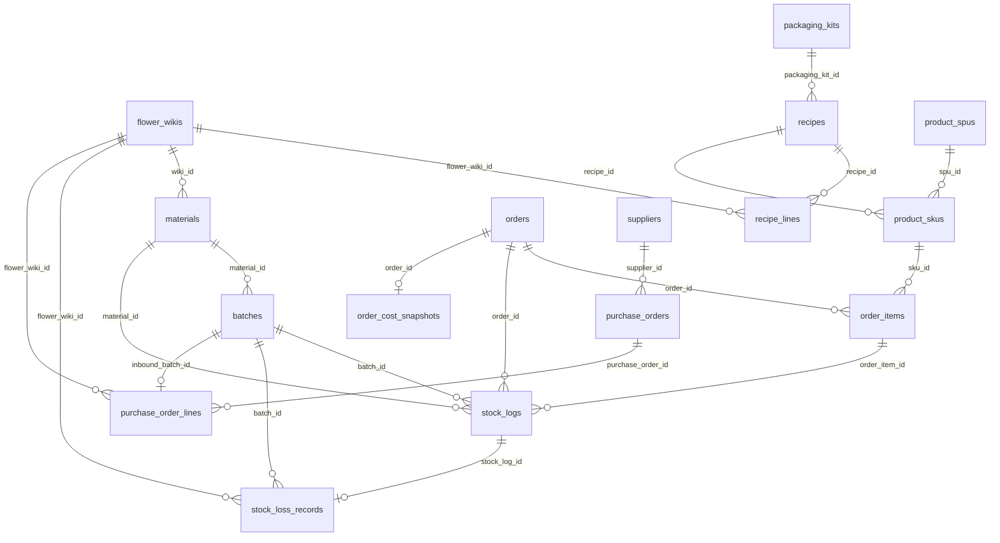

# Flower WMS System — 架构说明

> 文档版本：基于当前代码库静态审计更新。
> 应用根目录：`flower-wms-system/`。物理表名以 `prisma/schema.prisma` 的 `@@map(...)` 为准。
> 本文只描述当前代码真实存在的模型、服务、API、页面和脚本。

---

## 1. 项目技术全景定位

Flower WMS System 是 Universe42 / 万物肆贰鲜花的鲜花行业 **WMS + CMS + 微信小程序 API** 平台，技术栈为：

| 层级 | 当前实现 |
|---|---|
| Web | Next.js 16 App Router |
| UI | React 19 + Tailwind CSS 4 |
| ORM | Prisma 7，client 输出到 `src/generated/prisma` |
| DB | PostgreSQL |
| Auth | Auth.js / next-auth v5 beta，后台 StaffUser RBAC |
| 小程序 | 仓库根目录 `42_mp/` |
| 部署 | Dockerfile + docker-compose，Next standalone，cron worker |

当前已实现能力：

- WMS 花材母表、标准配方、包装方案、物理批次库存、手工入库、指定批次报损、销售 FIFO、退款回库。
- CMS 商品 SPU/SKU、商品分类、轮播、营销配置、SKU 绑定 Recipe、SKU 毛利预估展示。
- 微信小程序用户登录、商品浏览、购物车、下单、mock 支付、订单查询。
- 订单真实毛利核算：`OrderCostSnapshot`。
- 产品级毛利预估：`FlowerWiki.standardUnitCost` + `Recipe` + `PackagingKit` + SKU price。
- 经营报表中心：销售、趋势、毛利排行、低毛利、成本结构、花材使用、损耗、库存预警、采购复盘与供应商分析。
- 供应商与采购单：`Supplier` / `PurchaseOrder` / `PurchaseOrderLine`。
- 采购单到货入库：生成 `Batch` + `StockLog: INBOUND`，回写 `PurchaseOrderLine.inboundBatchId`。
- 采购复盘：供应商采购排行、花材采购价趋势、批次销售转化、批次销售成本贡献、采购建议标签。

### 当前不存在 / 不应假设存在

| 能力 | 当前状态 |
|---|---|
| 多租户 SaaS | 未实现；无 `tenantId` 或租户隔离模型 |
| 正式微信支付 | 未实现；`mock-pay` 可用，`callback` 是占位链路 |
| 聚合配送 / 第三方配送 | 未实现 |
| 对象存储 | 未实现；上传写本地 `public/uploads` |
| Redis / MQ | 未实现；`package.json` 无相关依赖 |
| 包装物理库存扣减 | 未实现；`PackagingKit` 只代表标准包装成本 |
| 供应商付款 / 对账 / 发票 | 未实现 |
| Excel 导入导出 | 未实现 |
| CRM / SaaS 计费 | 未实现 |

历史命名对照：

```text
stock_batches（不存在）     -> batches
product_bom（已废弃）       -> recipes + recipe_lines + product_skus.recipe_id
product_spus.recipe_id      -> 已删除；配方绑定在 product_skus.recipe_id
```

---

## 2. 目录结构与模块边界

```text
flower-wms-system/
├── prisma/
│   ├── schema.prisma
│   └── migrations/
├── scripts/
│   ├── cron-inventory-daemon.ts
│   ├── smoke-purchase-flow.ts
│   ├── smoke-purchase-analytics.ts
│   └── sync-physical-to-virtual-stock.ts
├── src/
│   ├── app/
│   │   ├── api/
│   │   ├── cms/
│   │   ├── wms/
│   │   └── admin/
│   ├── components/
│   ├── generated/prisma/
│   ├── lib/
│   ├── services/
│   └── utils/
└── package.json
```

### 关键 service

| 文件 | 职责 |
|---|---|
| `src/services/purchase-pure.ts` | 采购成本纯计算、附加费用分摊 |
| `src/services/purchase.ts` | 供应商 CRUD、采购单 CRUD、取消、入库、标准成本更新 |
| `src/services/order-cost-pure.ts` | 订单成本纯计算 |
| `src/services/order-cost.ts` | `OrderCostSnapshot` 计算、查询、重算 |
| `src/services/product-margin-pure.ts` | 产品毛利预估纯计算 |
| `src/services/product-margin.ts` | SKU / SPU 毛利预估服务 |
| `src/services/business-report-pure.ts` | 报表纯函数 |
| `src/services/business-report.ts` | 经营报表与缺失快照 backfill |
| `src/services/purchase-analytics-pure.ts` | 采购复盘纯计算：summary、供应商排行、花材价趋势、批次转化、成本贡献、建议标签 |
| `src/services/purchase-analytics.ts` | 采购复盘 Prisma 查询与 API DTO 序列化 |
| `src/services/order-fifo.ts` | 支付后 FIFO 扣物理库存并生成订单成本快照 |
| `src/services/fifo.ts` | FIFO 扣减算法与 StockLog 写入 |
| `src/services/wms-stock.ts` | 手工入库、指定批次报损、批次流水线 |
| `src/services/inventory-sync.ts` | 物理库存向 SKU 虚拟库存投影 |
| `src/services/recipe.ts` | Recipe / RecipeLine CRUD 和 BOM 编号 |
| `src/services/wiki.ts` | FlowerWiki CRUD 和检索 |

当前代码未发现独立 `src/services/supplier.ts`；供应商 service 逻辑在 `src/services/purchase.ts`。

---

## 3. WMS 页面路由

| 路径 | 组件 / 职责 |
|---|---|
| `/wms` | redirect 到 `/wms/dashboard` |
| `/wms/dashboard` | WMS 仪表盘 |
| `/wms/inventory` | 物理库存列表，仅展示有可用批次的 Material |
| `/wms/inventory/[id]` | 原材料详情：批次、库存流水、历史报损 |
| `/wms/operations` | 仓储日常：手工入库、报损、批次流水线 |
| `/wms/purchase-orders` | 采购单管理：列表、详情、编辑、取消、到货入库、标准成本更新 |
| `/wms/suppliers` | 供应商管理 |
| `/wms/wiki` | FlowerWiki 母表 |
| `/wms/recipes` | 标准配方研发中心 |
| `/wms/packaging-kits` | 包装方案管理 |
| `/wms/material-categories` | 原材料分类 |
| `/wms/orders` | 订单履约看板 |
| `/wms/reports` | 经营报表中心（Tab：经营总览、销售趋势、商品毛利、库存预警、损耗模型影响、采购复盘） |
| `/wms/batches` | redirect 到 `/wms/operations` |
| `/wms/wastage` | redirect 到 `/wms/operations?panel=loss` |
| `/wms/bom` | redirect 到 `/wms/recipes` |

导航定义：`src/components/wms/sidebar.tsx`。

---

## 4. CMS 页面路由

| 路径 | 职责 |
|---|---|
| `/cms/products` | 商品列表，展示 SKU 毛利预估信息 |
| `/cms/products/[id]` | 商品编辑，SKU 绑定 Recipe，展示毛利预估和 warning |
| `/cms/product-categories` | 商城商品分类树 |
| `/cms/banner` | 首页轮播 |
| `/cms/marketing` | 营销配置 |
| `/cms/carousel` | redirect 到 `/cms/banner` |
| `/cms/categories` | redirect 到 `/cms/product-categories` |

CMS 商品编辑边界：

- CMS 可以维护 SPU/SKU、价格、图文、商品分类、轮播与营销配置。
- SKU 通过 `ProductSku.recipeId` 只读绑定 WMS Recipe。
- CMS 不维护 RecipeLine 明细，不直接修改库存。
- `PATCH /api/cms/skus/[id]` 只允许图文白名单字段，防止 mass assignment。

---

## 5. 后台 API 边界

### WMS 采购与供应商

| 方法 | 路径 |
|---|---|
| GET / POST | `/api/admin/wms/suppliers` |
| GET / PUT / DELETE | `/api/admin/wms/suppliers/[id]` |
| GET / POST | `/api/admin/wms/purchase-orders` |
| GET / PUT | `/api/admin/wms/purchase-orders/[id]` |
| POST | `/api/admin/wms/purchase-orders/[id]/cancel` |
| POST | `/api/admin/wms/purchase-orders/[id]/receive` |
| POST | `/api/admin/wms/purchase-orders/calculate-preview` |
| POST | `/api/admin/wms/purchase-orders/lines/[lineId]/update-standard-cost` |
| POST | `/api/admin/wms/purchase-orders/[id]/update-standard-costs` |

### WMS 其他

| 路径 | 说明 |
|---|---|
| `/api/admin/wms/recipes`、`/[id]` | 配方 CRUD |
| `/api/admin/wms/packaging-kits`、`/[id]` | 包装方案 CRUD / 停用 |
| `/api/admin/wms/stock-in` | 手工入库 |
| `/api/admin/wms/stock-loss` | 指定批次报损 |
| `/api/admin/wms/stock-batches` | 按 FlowerWiki 查可用批次 |
| `/api/admin/wms/stock-loss/history` | 报损历史 |
| `/api/admin/wms/stock-pipeline` | 在库批次流水线 |
| `/api/admin/wms/material-categories`、`/[id]` | 原材料分类 |
| `/api/admin/wms/bom` | 410，旧 BOM API 已迁移至 recipes |

### 成本 / 报表 / 商品预估

| 路径 | 说明 |
|---|---|
| `GET /api/admin/orders/[id]/cost` | 订单成本详情 |
| `POST /api/admin/orders/[id]/cost/recalculate` | 重算成本快照 |
| `PATCH /api/admin/orders/[id]/delivery-cost` | 写实际配送成本并重算 |
| `GET /api/admin/products/[id]/margin-estimate` | 商品毛利预估 |
| `POST /api/admin/products/[id]/margin-estimate/recalculate` | 重新计算商品毛利预估 |
| `GET /api/admin/cms/skus/[id]/margin-estimate` | SKU 毛利预估 |
| `/api/admin/reports/*` | 经营报表中心 API |

报表 API：

- `dashboard`
- `business-summary`
- `daily-sales`
- `product-profit-ranking`
- `low-margin-orders`
- `cost-structure`
- `material-usage`
- `wastage`
- `inventory-alerts`
- `loss-model-impact`
- `purchase-analytics`
- `backfill-cost-snapshots`

权限：

- 后台 API 使用 `src/lib/api-auth.ts` 的 `requirePermission`。
- `IT_ADMIN` 不能访问业务数据。
- `wms:write`：`STORE_ADMIN` / `WAREHOUSE_MANAGER`。
- `orders:write`：`STORE_ADMIN` / `FLORIST`。
- `business:read` / `business:write` 用于成本与报表相关接口。

---

## 6. 数据模型血缘

### 关键 Prisma 模型

| 模型 | 表 | 说明 |
|---|---|---|
| `FlowerWiki` | `flower_wikis` | 花材母表；标准成本字段用于产品预估 |
| `Material` | `materials` | 仓储原材料，通常通过 `wikiId` 关联 FlowerWiki |
| `Batch` | `batches` | 物理库存批次，含 `unitCost`、`remainingQty` |
| `StockLog` | `stock_logs` | 库存流水 |
| `StockLossRecord` | `stock_loss_records` | 报损留痕 |
| `Recipe` | `recipes` | 标准配方，含 `packagingKitId` |
| `RecipeLine` | `recipe_lines` | 配方花材明细 |
| `PackagingKit` | `packaging_kits` | 标准包装成本 |
| `ProductSpu` | `product_spus` | 商城商品 |
| `ProductSku` | `product_skus` | SKU，含 `recipeId` |
| `Order` | `orders` | 小程序订单，含 `deliveryCostActual` / `deliveryCostNote` |
| `OrderCostSnapshot` | `order_cost_snapshots` | 订单真实毛利快照 |
| `Supplier` | `suppliers` | 供应商 |
| `PurchaseOrder` | `purchase_orders` | 采购单 |
| `PurchaseOrderLine` | `purchase_order_lines` | 采购明细，入库后关联 Batch |

### ER 简图



### 三条成本链路

产品预估链路：

```text
FlowerWiki.standardUnitCost
  -> RecipeLine.quantityNeeded
  -> Recipe + PackagingKit.standardCost
  -> ProductSku.price
  -> estimated gross margin / suggested prices
```

订单实际链路：

```text
Order
  -> SALE_OUT StockLog
  -> Batch.unitCost
  -> OrderCostSnapshot
  -> Business reports
```

采购成本源头链路：

```text
PurchaseOrderLine.actualUnitCost
  -> Batch.unitCost
  -> SALE_OUT StockLog
  -> OrderCostSnapshot
```

必须区分：

- `FlowerWiki.standardUnitCost`：产品预估成本。
- `Batch.unitCost`：订单实际成本。
- `PurchaseOrderLine.actualUnitCost`：采购分摊后的入库成本，receive 后写入 Batch。

---

## 7. 订单与双轨库存

### 双轨库存

| 库存 | 表/字段 | 时点 |
|---|---|---|
| 虚拟可售库存 | `product_skus.stock` | 创建订单时扣减 |
| 物理批次库存 | `batches.remaining_qty` | 支付成功后 FIFO 扣减 |

支付链路：

```text
markOrderPaidWithFifo
  -> orders: PENDING_PAYMENT -> PAID
  -> order items -> sku.recipe -> recipe_lines
  -> expand demands by FlowerWiki
  -> Material(wikiId)
  -> FIFO batches by createdAt ASC
  -> decrement Batch.remainingQty
  -> create StockLog: SALE_OUT
  -> upsert OrderCostSnapshot
```

订单真实毛利生成时机：

- mock 支付 / 后台标记已支付 / 回调占位进入 `markOrderPaidWithFifo` 后生成或更新。
- `deliveryCostActual` 变更后，`PATCH /api/admin/orders/[id]/delivery-cost` 会触发重算。
- 退款后历史快照保留，报表会按退款状态排除或单独统计；库存通过 `IN_CANCEL` 原路回库。

订单成本不使用 `FlowerWiki.standardUnitCost`；它只使用历史 `SALE_OUT` 对应的 `Batch.unitCost`。

---

## 8. 产品级毛利预估

相关文件：

- `src/services/product-margin-pure.ts`
- `src/services/product-margin.ts`
- `src/app/api/admin/products/[id]/margin-estimate/route.ts`
- `src/app/api/admin/cms/skus/[id]/margin-estimate/route.ts`
- `src/app/cms/products/ProductEditor.tsx`

输入：

- `FlowerWiki.standardUnitCost`
- `FlowerWiki.costUnit`
- `FlowerWiki.costNote`
- `FlowerWiki.costUpdatedAt`
- `RecipeLine.quantityNeeded`
- `Recipe.packagingKitId`
- `PackagingKit.standardCost`
- `ProductSku.price`

输出：

- 标准花材成本。
- 标准包装成本。
- 总标准成本。
- SKU 预估毛利。
- SKU 预估毛利率。
- 建议售价区间。
- 成本完整性 warnings。

warning 场景：

- SKU 未绑定 Recipe。
- Recipe 未绑定 PackagingKit。
- Recipe 中 FlowerWiki 缺少 `standardUnitCost`。
- SKU price 无效或缺失。

产品级毛利预估是定价辅助，不覆盖历史订单真实毛利。

---

## 9. 经营报表中心

入口：

- 页面：`/wms/reports`
- 服务：`src/services/business-report.ts`
- API：`/api/admin/reports/*`

报表：

| 报表 | 数据口径 |
|---|---|
| Sales summary | 有效订单 + `OrderCostSnapshot` |
| Daily sales trend | 按日期聚合销售额与成本 |
| Product profit ranking | 优先用订单项 SALE_OUT 精确花材成本，否则按订单比例分摊 |
| Low margin orders | 低毛利订单筛选 |
| Cost structure | 花材、包装、配送等成本占比 |
| Material usage cost | `SALE_OUT × Batch.unitCost` |
| Wastage | `StockLossRecord.lossQuantity × Batch.unitCost` |
| Inventory alerts | 当前批次剩余数量与库存价值 |
| Loss model impact | `SALE_OUT` 花材成本按 `Batch.lossAdjustedUnitCost`（fallback `unitCost`）估算损耗模型影响 |
| Purchase analytics | `RECEIVED` 采购单按 `receivedAt`（fallback `purchaseDate` / `createdAt`）聚合；批次转化来自 `StockLog` |

采购复盘数据口径：

- 采购金额与成本：优先 `PurchaseOrder` / `PurchaseOrderLine` 已入库数据。
- 批次销售转化：`SALE_OUT` / `WASTAGE_OUT` / `IN_CANCEL` / `ADJUSTMENT` 流水；`actualWastageRate` 仅来自真实 `WASTAGE_OUT`。
- 损耗模型影响：来自 `Batch.lossAdjustedUnitCost` 或 `PurchaseOrderLine.lossAdjustedUnitCost`，是经营估算，不等同于真实报损。
- 批次销售成本贡献：`soldQty × Batch.unitCost` / `lossAdjustedUnitCost`；不做订单收入分摊，因此不是批次毛利。

库存价值公式：

```text
inventoryValue = sum(batch.remainingQty × batch.unitCost)
```

缺失快照处理：

- 报表会返回 warnings。
- `POST /api/admin/reports/backfill-cost-snapshots` 可补算缺失 `OrderCostSnapshot`。

---

## 10. 采购与供应商

### Supplier

`SupplierType`：

- `LOCAL`
- `KUNMING_ONLINE`
- `WHOLESALE_MARKET`
- `PLATFORM`
- `OTHER`

供应商停用是软停用：`isActive = false`。停用不影响历史采购单查看。

### PurchaseOrder 状态机

```text
DRAFT -> ORDERED -> RECEIVED
DRAFT -> CANCELLED
ORDERED -> CANCELLED
```

约束：

- `DRAFT` / `ORDERED` 可编辑。
- `RECEIVED` 不可修改核心金额和明细。
- `RECEIVED` 不可重复入库。
- `CANCELLED` 不可入库。

### PurchaseOrderLine 成本字段

| 字段 | 说明 |
|---|---|
| `purchaseQuantity` | 采购数量 |
| `purchaseUnit` | 扎 / 支 / 把 / 盒等 |
| `stemsPerUnit` | 每单位折算支数 |
| `totalStems` | `purchaseQuantity × stemsPerUnit` |
| `unitPrice` | 采购单价 |
| `lineAmount` | `purchaseQuantity × unitPrice` |
| `allocatedExtraFee` | 分摊附加费用 |
| `actualTotalCost` | 明细实际总成本 |
| `actualUnitCost` | 实际单支成本 |
| `inboundBatchId` | 到货入库后关联 Batch |

BY_AMOUNT 分摊：

```text
allocatedExtraFee = totalExtraFee × lineAmount / goodsAmount
actualTotalCost = lineAmount + allocatedExtraFee
actualUnitCost = actualTotalCost / totalStems
```

`goodsAmount = 0` 时不分摊附加费用并返回 warning。

### receivePurchaseOrder 事务

服务：`src/services/purchase.ts`。

流程：

```text
receivePurchaseOrder
  -> require wms:write + operator check
  -> transaction
     1. load PurchaseOrder + Supplier + lines + FlowerWiki
     2. 校验状态：非 CANCELLED / RECEIVED，且有明细
     3. 原子状态锁：DRAFT/ORDERED + receivedAt null -> RECEIVED
     4. 每行 resolveOrCreate Material(wikiId)
     5. generate batchNo
     6. create Batch
        - originalQty = totalStems
        - remainingQty = totalStems
        - unitCost = actualUnitCost
        - supplier = supplier.name
     7. create StockLog: INBOUND
        - materialId / batchId
        - quantity = totalStems
        - delta = totalStems
        - remark 包含 purchaseNo
     8. update PurchaseOrderLine.inboundBatchId
  -> return purchaseOrder + createdBatches + stockLogs
```

任一步失败，整张采购单回滚，不会出现只创建 Batch 或只写状态的部分成功。

### 与手工入库关系

- 手工入库：`POST /api/admin/wms/stock-in`，直接录入 FlowerWiki、束数、每束支数、单束采购价。
- 采购入库：从 PurchaseOrderLine 的分摊后 `actualUnitCost` 生成 Batch。
- 两者最终都进入 `Batch` + `StockLog: INBOUND`，因此库存页面、FIFO、订单成本和报表可以复用同一链路。

### 用采购价更新标准成本

已实现：

- 单行：`POST /api/admin/wms/purchase-orders/lines/[lineId]/update-standard-cost`
- 整单：`POST /api/admin/wms/purchase-orders/[id]/update-standard-costs`
- UI：RECEIVED 采购单详情页按钮“用本次采购价更新标准成本”

该功能只更新 `FlowerWiki.standardUnitCost`，用于后续产品预估，不影响历史订单快照。

---

## 11. WMS 库存核心

### Material / Batch / StockLog

| 模型 | 角色 |
|---|---|
| `Material` | 仓储原材料，采购和手工入库尽量绑定 `wikiId` |
| `Batch` | 可 FIFO 扣减的物理批次 |
| `StockLog` | 所有库存变化的流水事实 |

`StockLogType`：

- `INBOUND`：入库，手工或采购。
- `SALE_OUT`：销售出库。
- `WASTAGE_OUT`：指定批次报损。
- `ADJUSTMENT`：盘点调整。
- `IN_CANCEL`：订单取消 / 退款回库。

### 库存页面兼容性

- `/wms/inventory` 使用 `src/lib/wms-inventory.ts`，只展示 `remainingQty > 0` 的批次对应 Material。
- `/wms/inventory/[id]` 使用 `src/services/wms-inventory-detail.ts`，展示批次与 StockLog；`INBOUND` remark 会显示采购单号。
- `/wms/operations` 批次流水线使用 `listActiveBatchPipeline`，展示 batchNo、supplier、unitCost、remainingQty。

采购入库批次只要 `remainingQty > 0`，就会进入上述页面。

---

## 12. Docker / 部署

Docker 文件位于仓库根目录：

- `Dockerfile`
- `docker-compose.yml`
- `docker-compose.example.yml`

compose 服务：

| 服务 | 说明 |
|---|---|
| `flower-nginx` | Nginx 网关 |
| `flower-web` | Next.js Web 应用 |
| `flower-cron-worker` | 库存投影 cron worker |
| `db` | PostgreSQL |

`flower-wms-system/docker-entrypoint.sh`：

- 默认执行 `npx prisma migrate deploy`。
- `SKIP_DB_MIGRATE=true` 时跳过。

Dockerfile：

- builder 阶段执行 `npx prisma generate` 和 `npm run build`。
- runner 阶段使用 Next standalone。
- healthcheck 请求 `/login`。

当前 compose 没有为 `public/uploads` 配置持久化卷；上传文件持久性需要部署层额外处理。

---

## 13. 脚本与测试

### package scripts

| 命令 | 说明 |
|---|---|
| `npm run dev` | 开发服务 |
| `npm run build` | 生产构建 |
| `npm run start` | 生产启动 |
| `npm run lint` | ESLint |
| `npm run test:cost` | 订单成本纯函数测试 |
| `npm run test:reports` | 报表纯函数测试 |
| `npm run test:purchase` | 采购成本纯函数测试 |
| `npm run test:margin` | 产品毛利纯函数测试 |
| `npm run db:seed` | Prisma seed |
| `npm run smoke:purchase` | 采购入库 DB smoke |
| `npm run seed:test-products` | 测试商品种子 |

### smoke:purchase

`scripts/smoke-purchase-flow.ts` 会：

1. 找到或创建测试供应商。
2. 找到或创建测试 FlowerWiki。
3. 创建采购单：2 扎、每扎 10 支、单价 20、运费 10、包装费 5。
4. 断言 `goodsAmount = 40`、`totalExtraFee = 15`、`actualUnitCost = 2.75`。
5. 执行采购入库。
6. 断言 Batch、StockLog、Material 库存和成本字段一致。

运行前需要可连接的 PostgreSQL `DATABASE_URL` 且已应用 migrations。

---

## 14. 经营红线 / 架构防线

1. 配方保存只写 `recipes` / `recipe_lines`，不能产生库存副作用。
2. 库存变化必须通过 `StockLog` 留痕，不能绕过流水直接改 Batch。
3. 报损必须指定批次，不能恢复为自动 FIFO 报损。
4. 订单实际毛利必须基于历史 `SALE_OUT` 和 `Batch.unitCost`。
5. 产品预估毛利必须基于 `FlowerWiki.standardUnitCost`，不得混用订单实际批次成本。
6. `PackagingKit.standardCost` 用于 BOM 预估和订单包装成本快照，不代表包装物理库存。
7. 采购单入库必须写 Batch + `StockLog: INBOUND`。
8. 采购单不能绕过库存流水直接增加库存。
9. `RECEIVED` 采购单不能重复入库。
10. `RECEIVED` 采购单不能修改核心金额和明细。
11. `CANCELLED` 采购单不能入库。
12. 供应商停用不能影响历史采购单。
13. 经营报表优先基于 `OrderCostSnapshot`，不应每次用当前成本重算历史毛利。
14. CMS SKU 营销 PATCH 只能改图文白名单字段，不得 mass assignment。
15. `stock_batches` 不是当前表名，当前批次表为 `batches`。
16. `product_bom` 已废弃；当前配方体系为 `recipes` + `recipe_lines` + `product_skus.recipe_id`。
17. 当前不是多租户 SaaS，新增业务代码不得假设 tenant 隔离已存在。
18. 采购复盘不得把 `lossAdjustedUnitCost` 当作真实采购成本覆盖 `Batch.unitCost`。
19. 实际报损率（`WASTAGE_OUT`）不得与模型损耗率（`lossRate` / `usableRate`）混用。
20. 批次成本贡献不得命名为批次毛利，除非未来实现收入分摊。

---

## 15. 已知悬空 / 待重构

| 项 | 状态 |
|---|---|
| 多租户 SaaS | 未实现 |
| 正式微信支付 | 未实现，当前为 mock / callback 占位 |
| 对象存储 | 未实现，当前本地 uploads |
| Redis / MQ | 未实现 |
| 完整测试体系 | 当前以 tsx 轻量测试和 smoke script 为主 |
| 供应商付款 / 对账 / 发票 | 未实现 |
| Excel 导入导出 | 未实现 |
| CRM | 未实现 |
| SaaS 计费 | 未实现 |
| 包装物理库存 | 未实现 |
| `services/inbound.ts` | 遗留文件，当前未发现 import 方 |
| 平台费 / 人工 / 其他成本 | 快照字段存在，但当前订单成本计算按 0 |

---

## 16. 文档维护规则

- 变更 Prisma Schema 后，同步更新本文 ER 和模型说明。
- 新增 WMS API 时，同步更新 API 表和服务职责。
- 变更订单成本 / 产品预估 / 报表口径时，必须同步更新三条成本链路。
- 变更采购入库时，必须同步更新采购事务步骤和库存红线。
- 不要在文档中写当前代码未实现的能力。
