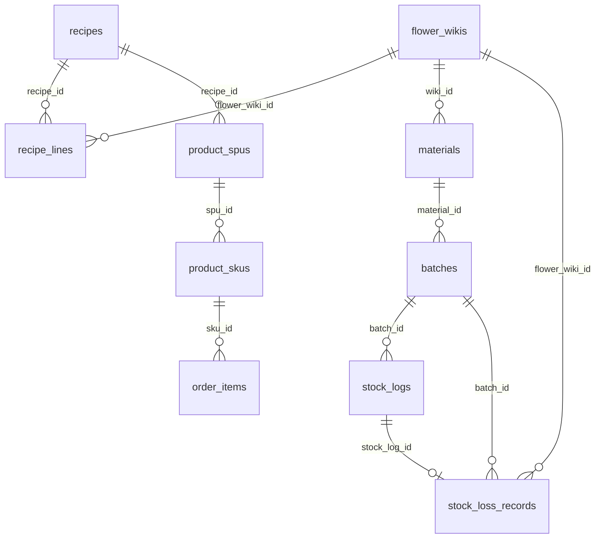

# Flower WMS System — 架构概览

> 文档版本：基于代码库静态审计生成（Next.js App Router + Prisma + PostgreSQL）。  
> 应用根目录：`flower-wms-system/`。所有物理表名以 `prisma/schema.prisma` 的 `@@map(...)` 为准。

---

### 🌿 项目技术全景定位

本系统是基于 **Next.js 16（App Router）+ React 19 + Tailwind CSS 4 + Prisma 7 + PostgreSQL** 的全栈数字化鲜花大仓供应链管理系统。

核心能力边界：

- **WMS 端（`/wms`）**：主导物料母表、标准工艺配方（BOM）、物理批次库存、仓储日常（入库 / 指定批次报损）、库存查询、订单履约看板。
- **CMS 端（`/cms`）**：纯粹的小程序运营货架——商品 SPU/SKU、商品分类、轮播、营销配置；通过 `ProductSpu.recipeId` **只读绑定** WMS 配方，不在 CMS 维护 BOM 明细。
- **微信小程序 API（`/api/wechat/*`）**：用户登录、商品浏览、购物车、下单与 mock 支付、订单查询等。

技术栈要点：

| 层级 | 选型 |
|------|------|
| 框架 | Next.js App Router，Server / Client Component 混用 |
| ORM | Prisma Client，输出至 `src/generated/prisma` |
| 数据库 | PostgreSQL（`datasource db`） |
| 样式 | Tailwind CSS |
| 拼音检索 | `pinyin-pro` → `src/lib/pinyin-index.ts` |

**不存在于本代码库的能力（请勿臆造）**：多租户 SaaS、聚合配送调度、独立的 `stock_batches` / `product_bom` 物理表、销售订单自动扣减物理批次库存（见下文「待重构」）。

---

### 📂 目录结构与核心模块边界

```
flower-wms-system/
├── prisma/
│   ├── schema.prisma          # 唯一数据模型真理源
│   └── migrations/            # 历史迁移 SQL
├── src/
│   ├── app/
│   │   ├── page.tsx           # 工作台门户（WMS / CMS 分流）
│   │   ├── wms/               # WMS 页面路由
│   │   ├── cms/               # CMS 页面路由
│   │   ├── admin/             # 管理壳（轻量）
│   │   └── api/
│   │       ├── admin/         # 后台 REST（含 wms、wiki、orders…）
│   │       ├── cms/           # CMS 专用 API
│   │       └── wechat/        # 小程序 API
│   ├── components/
│   │   ├── wms/               # WMS 侧栏等
│   │   ├── cms/               # CMS 侧栏、RecipeSelect、商品编辑器
│   │   ├── shared/            # QuantityStepper、上传区等
│   │   └── ui/                # FlowerMaterialSelect、Input、Button…
│   ├── services/              # 领域事务与查询（recipe、wms-stock、fifo…）
│   ├── lib/                   # 工具、序列化、库存查询 helper
│   └── generated/prisma/      # Prisma 生成物（勿手改）
```

#### WMS 页面路由（`src/app/wms/`）

| 路径 | 职责 |
|------|------|
| `/wms/dashboard` | 仪表盘指标、低库存、今日损耗等 |
| `/wms/inventory` | 物理库存列表（仅有 `remainingQty > 0` 批次） |
| `/wms/inventory/[id]` | 原材料详情：批次、流水、**历史报损日志** |
| `/wms/operations` | **仓储日常控制台**（入库 + 指定批次报损 + 左侧折叠流水线） |
| `/wms/wiki` | 物料母表（FlowerWiki）维护 |
| `/wms/recipes` | 标准配方研发中心 |
| `/wms/material-categories` | 原材料分类（与商品分类解耦） |
| `/wms/orders` | 小程序订单履约看板 |
| `/wms/batches` | → 重定向至 `/wms/operations` |
| `/wms/wastage` | → 重定向至 `/wms/operations?panel=loss` |
| `/wms/bom` | → 重定向至 `/wms/recipes` |

导航定义：`src/components/wms/sidebar.tsx`。

#### CMS 页面路由（`src/app/cms/`）

| 路径 | 职责 |
|------|------|
| `/cms/products` | 商品列表与编辑（含 `recipeId` 下拉绑定） |
| `/cms/product-categories` | 商城商品分类树 |
| `/cms/banner` | 首页轮播 |
| `/cms/marketing` | 营销配置（`app_configs`） |

导航定义：`src/components/cms/sidebar.tsx`。CMS **不包含** BOM 编辑、入库、报损入口。

#### WMS 后台 API（`src/app/api/admin/wms/`）

| 方法 | 路径 | 服务层 | 说明 |
|------|------|--------|------|
| GET/POST | `/api/admin/wms/recipes` | `services/recipe.ts` | 配方列表 / 创建 |
| GET/PUT/DELETE | `/api/admin/wms/recipes/[id]` | `services/recipe.ts` | 单条配方 CRUD |
| POST | `/api/admin/wms/stock-in` | `services/wms-stock.ts` | 原料到货入库 |
| POST | `/api/admin/wms/stock-loss` | `services/wms-stock.ts` | **指定批次**物理报损 |
| GET | `/api/admin/wms/stock-batches` | `services/wms-stock.ts` | 按 `flowerWikiId` 查可用批次 |
| GET | `/api/admin/wms/stock-loss/history` | `services/wms-stock.ts` | 报损历史 |
| GET | `/api/admin/wms/stock-pipeline` | `services/wms-stock.ts` | 在库批次流水线 |
| GET/POST | `/api/admin/wms/material-categories` | `lib/material-category*` | 原材料分类 |
| GET/POST | `/api/admin/wms/inbound/confirm` | `services/wiki-inbound.ts` | Wiki 撞库 / 双写入库（旧链路） |
| GET/POST | `/api/admin/wms/bom` | — | **410**，已迁移至 `recipes` |
| POST | `/api/admin/wms/ai-preview` | `@/lib/wiki-ai` | AI 花材图像预览（依赖外部模块） |

#### 物料母表 API（WMS 数据，路径在 `admin/wiki`）

| 路径 | 说明 |
|------|------|
| `/api/admin/wiki` | 列表 / 创建；支持 `q` 简拼检索 |
| `/api/admin/wiki/[id]` | 单条读写 |

#### 业务解耦原则（代码现状）

```
FlowerWiki（母表真理）
    ├── RecipeLine（配方明细，仅工艺公式）
    ├── Material（物理仓储 SKU，入库时按需创建）
    │       └── Batch（物理批次，独立进价）
    └── StockLossRecord（报损留痕）

ProductSpu（CMS 商品）
    ├── ProductSku（可售库存 stock 字段）
    └── recipeId → Recipe（只读引用，不反向写库存）
```

---

### 📡 主数据血缘与「WMS 配方中心」

#### 中央真理源：`flower_wikis`

Prisma 模型：`FlowerWiki` → 表 **`flower_wikis`**。

| 字段（DB snake_case） | 应用层 | 用途 |
|----------------------|--------|------|
| `english_name` | `englishName` | 拉丁学名，唯一 |
| `chinese_name` | `chineseName` | 中文常用名 |
| `pinyin_index` | `pinyinIndex` | 简拼索引，写入时由 `toPinyinIndex()` 生成 |
| `color_tags` | `colorTags` | 色系标签数组 |
| `floral_role` | `floralRole` | 枚举：主花 / 配花 / 线条 / 叶材 |
| `alias_map` | `aliasMap` | JSON 别名 |

**简拼检索流**：

1. 创建 / 更新 Wiki 时：`src/lib/pinyin-index.ts` 用 `pinyin-pro` 取首字母 → 如「矢车菊」→ `scj`。
2. 列表查询：`services/wiki.ts` 的 `buildWhere()` 对 `englishName`、`chineseName`、`pinyinIndex` 做 `contains` OR 检索。
3. 前端组件：`src/components/ui/FlowerMaterialSelect.tsx` 调用 `GET /api/admin/wiki?q=…`，用于配方研发、仓储报损等场景。

#### 标准配方：`recipes` + `recipe_lines`

| 模型 | 物理表 | 说明 |
|------|--------|------|
| `Recipe` | `recipes` | 配方主表 |
| `RecipeLine` | `recipe_lines` | 明细行 |

**关键字段血缘**：

- `recipes.recipe_code` ← 系统自动生成，格式 **`BOM-YYYYMMDD-XXX`**（见 `services/recipe.ts` → `generateNextRecipeCode()`，Serializable 事务防碰撞）。
- `recipes.name` ← **必填**，用户输入的配方名称（非单号）。
- `recipe_lines.flower_wiki_id` → `flower_wikis.id`（**直接关联母表**，不关联 `materials`）。
- `recipe_lines.quantity_needed` ← 所需枝数。

**与 CMS 的绑定**：`product_spus.recipe_id` → `recipes.id`。CMS 通过 `src/components/cms/RecipeSelect.tsx` 拉取 `/api/admin/wms/recipes` 展示 `{code} - {name} ({summary})`。

#### 配方保存的沙盒隔离（已实现）

`services/recipe.ts` 中 `writeRecipeLines()` **仅**执行：

1. `recipeLine.deleteMany` + `createMany`（写 `recipe_lines`）；
2. `assertWikiIdsExist` 校验母表 ID。

**不会**创建 `materials`、**不会**写入 `batches` / `stock_logs`。因此配方研发不会产生物理库存副作用。

库存列表防护：`src/lib/wms-inventory.ts` 的 `physicalStockMaterialWhere` 要求 `batches.some({ remainingQty: { gt: 0 } })`，避免「零库存幽灵 Material」出现在 `/wms/inventory`。

#### UI：`/wms/recipes`

- 组件：`src/app/wms/recipes/WmsRecipeConsole.tsx`
- 能力：配方名称、简拼选花材、`QuantityStepper` 数量、保存后重置表单
- API：`POST /api/admin/wms/recipes` body `{ name, ingredients: [{ flowerWikiId, quantity }] }`

---

### 📦 WMS 库存核心：销售 FIFO 与批次精准报损

#### 物理表模型（Schema First）

| Prisma 模型 | 物理表 | 说明 |
|-------------|--------|------|
| `Material` | `materials` | 仓储原材料；`wiki_id` 可选关联母表 |
| `Batch` | **`batches`** | 物理库存批次（**非** `stock_batches`） |
| `StockLog` | `stock_logs` | 全量库存流水 |
| `StockLossRecord` | `stock_loss_records` | 报损专表留痕 |

`batches` 核心字段：`original_qty`、`remaining_qty`、`unit_cost`（批次独立进价）、`inbound_at`、`created_at`、`supplier`。

#### 两种扣库逻辑的本质区别

| 场景 | 实现位置 | 算法 | 状态 |
|------|----------|------|------|
| **销售出库 FIFO** | `src/services/fifo.ts` | 按 `createdAt ASC` 查 `remainingQty > 0` 的批次，跨批次扣减并写 `StockLogType.SALE_OUT` | 算法已实现；**[待架构重构/Pending Refactoring]** 当前 `order-lifecycle.ts` 仅扣减 `product_skus.stock`，**未调用** `applyFifoDeductions()`，物理批次与销售未打通 |
| **物理损耗盘点** | `src/services/wms-stock.ts` → `runStockLossTransaction()` | 操作员指定 `stockBatchId`，单批次精准扣减 | **已上线**，主路径 `/api/admin/wms/stock-loss` |

##### 1. 销售 FIFO（设计意图，代码已备未接）

```text
calculateFifoDeductions(materialId, qty)
  → batches WHERE remaining_qty > 0 ORDER BY created_at ASC
  → 依次扣减直至 qty 为 0

applyFifoDeductions({ logType: SALE_OUT, ... })
  → 事务内 update batch + insert stock_logs
```

##### 2. 物理报损：指定批次精准扣减（当前生产路径）

**API**：`POST /api/admin/wms/stock-loss`

请求体（`src/types/index.ts` → `WmsStockLossBody`）：

```json
{
  "flowerWikiId": "uuid",
  "stockBatchId": "cuid",
  "lossQuantity": 5,
  "reason": "自然开败",
  "operator": "可选"
}
```

事务逻辑（`runStockLossTransaction`）：

1. 校验批次存在且 `batch.material.wikiId === flowerWikiId`；
2. 若 `lossQuantity > batch.remainingQty` → 报错 **「报损数量超出该批次可用库存」**；
3. `batches.remaining_qty` 递减；
4. 写 `stock_logs`（`WASTAGE_OUT`）；
5. 写 **`stock_loss_records`**（关联 `flower_wiki_id`、`batch_id`、`stock_log_id`）。

**报损历史查询**：

- `GET /api/admin/wms/stock-loss/history?flowerWikiId=` 或 `?materialId=`

#### 原料到货入库

**API**：`POST /api/admin/wms/stock-in`  
服务：`runStockInTransaction()` — 为每次到货创建**独立** `batches` 行 + `INBOUND` 流水；若该 Wiki 尚无 Material 则创建 `materials`（入库场景合理，与配方沙盒不同）。

#### 仓储日常 UI（`/wms/operations`）

| 文件 | 职责 |
|------|------|
| `WmsStockConsole.tsx` | 双栏：左流水线 + 右入库 / 报损 Tab |
| `BatchPipelinePanel.tsx` | 左侧折叠流水线 |

**左侧流水线（Group By & Collapse）**：

- 按 `flowerWikiId`（无则退化为 `materialId`）分组；
- **默认全部收起**；
- 收起态展示：花材名（`text-lg` / `md:text-xl font-bold`）、批次数 Tag、库中总计支数、库存总价值（Σ 剩余 × 进价）；
- 点击展开：CSS `grid-rows` 过渡动画，内嵌按 `createdAt` 排序的批次小卡片。

**右侧报损面板**：

- 文案：「请选择实际发生物理损耗的花材批次进行扣减」；
- 流程：简拼选花材 → `GET /api/admin/wms/stock-batches` 填充 Select → 选定批次后启用 `QuantityStepper` 与提交；
- Select Option 格式：`批次: {日期} - 剩余: {n}支 - 进价: ¥{单价} - 供应商: {名}`。

#### 库存详情中的报损日志

`src/app/wms/inventory/[id]/page.tsx` + `services/wms-inventory-detail.ts`：

- 区块 **「📜 历史报损盘点日志」**：从 `stock_loss_records` 加载；
- 列：报损时间 | 报损批次（单号 / 日期）| 损耗数量 | 损耗原因。

#### 共享计数器组件

`src/components/shared/QuantityStepper.tsx`：

- 左右 ± 按钮（最小 44×44px 触控热区）；
- 中间 `type="number"` + `inputMode="numeric"` + `pattern="[0-9]*"`；
- `onBlur` 纠正空值 / 非法值为 `min`（默认 1）；
- 用于：配方研发、仓储入库、仓储报损等。

---

### 🚧 研发红线与架构防线

以下为**代码中已固化或从实现直接推导**的规矩；未在仓库中出现的策略不会写入。

#### 必须遵守

1. **配方保存零库存副作用**  
   `services/recipe.ts` 只写 `recipes` / `recipe_lines`，禁止在配方事务中创建 `materials` 或 `batches`。

2. **库存列表只展示真实物理库存**  
   使用 `lib/wms-inventory.ts` 的 `physicalStockMaterialWhere`，禁止对 `materials` 全表 `findMany` 作为库存展示。

3. **报损必须指定批次**  
   新链路只认 `stockBatchId`；禁止在 `stock-loss` 接口恢复「按时间戳自动 FIFO 扣损耗」。

4. **计数器交互标准**  
   WMS 数量输入统一走 `QuantityStepper`（加减 + 手动输入 + 移动端数字键盘），禁止退化为不可编辑的纯文本展示。

5. **物理命名规范**  
   DB 列 snake_case（`@@map`）；TypeScript / API JSON 使用 camelCase。

6. **CMS / WMS 分类完全解耦**  
   - 商品分类：`product_categories_list` + `product_categories`  
   - 原材料分类：`material_categories` + `material_category_relations`  
   二者无 `parentId` 交叉。

#### 已知悬空 / 待清理 `[待架构重构/Pending Refactoring]`

| 项 | 说明 |
|----|------|
| 销售 → 物理批次 FIFO | `fifo.ts` 已实现但无调用方；订单仍扣 `product_skus.stock`（`order-lifecycle.ts`） |
| 旧报损 API | `POST /api/admin/wastage` + `services/wastage.ts`（单批次扣减）仍存在；UI 已迁到 `/wms/operations`，建议废弃或 410 |
| 旧入库链路 | `InboundForm`、`/api/admin/batches`、`wiki-inbound` 与新版 `stock-in` 并存 |
| 旧 BOM 路由 | `/api/admin/products/bom`、`services/bom.ts` 等遗留；WMS 侧已 410 / 重定向 |
| 损耗 UI 死代码 | `wms/wastage/WastageWorkspace.tsx`、`WastageForm.tsx` 仍保留，页面已 redirect |
| AI 视觉依赖 | `ai-preview`、`ai/vision`、`wiki/ai-generate` 路由引用 `@/lib/wiki-ai`；该模块可能未纳入当前工作区 / 需环境变量，**生产启用前需单独验证** |
| Schema 注释滞后 | `schema.prisma` 头部仍写「RecipeLine ↔ Material」；实际已为 `flower_wiki_id`；`StockLogType.WASTAGE_OUT` 注释写「FIFO 扣减」，与当前报损实现不符 |
| Mock 数据 | `src/lib/mock/*` 部分页面未引用，仅测试 / 遗留 |

#### API 与枚举速查

**`StockLogType`（`stock_logs.type`）**

| 枚举 | 含义 |
|------|------|
| `INBOUND` | 采购入库 |
| `SALE_OUT` | 销售出库（设计为 FIFO） |
| `WASTAGE_OUT` | 损耗出库 |
| `ADJUSTMENT` | 盘点调整 |
| `IN_CANCEL` | 订单取消回库 |

**订单状态机**：`OrderStatus` — 待支付 → 已支付 → 制作中 → 配送中 → 已完成 / 已取消（`services/order-lifecycle.ts`）。

---

### 附录：核心 ER 关系（简图）



---

### 文档维护说明

- 变更 Prisma Schema 后，请同步更新本文「物理表名」与 ER 图。
- 新增 WMS API 请在 `src/app/api/admin/wms/` 落地，并在 `services/` 封装事务，避免 Route Handler 内联复杂 Prisma 逻辑。
- 若完成「销售 FIFO 与物理批次」打通，请移除文中对应 `[待架构重构]` 条目并补充 `order-lifecycle.ts` 调用链说明。
