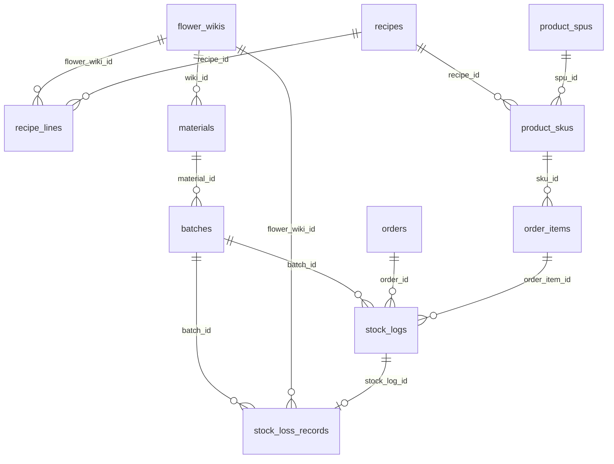

# Flower WMS System — 架构概览

> 文档版本：基于代码库静态审计生成（Next.js App Router + Prisma + PostgreSQL）。  
> 应用根目录：`flower-wms-system/`。所有物理表名以 `prisma/schema.prisma` 的 `@@map(...)` 为准。

---

### 🌿 项目技术全景定位

本系统是基于 **Next.js 16（App Router）+ React 19 + Tailwind CSS 4 + Prisma 7 + PostgreSQL** 的全栈数字化鲜花大仓供应链管理系统。

核心能力边界：

- **WMS 端（`/wms`）**：主导物料母表、标准工艺配方（BOM）、物理批次库存、仓储日常（入库 / 指定批次报损）、库存查询、订单履约看板。
- **CMS 端（`/cms`）**：纯粹的小程序运营货架——商品 SPU/SKU、商品分类、轮播、营销配置；通过 **`ProductSku.recipeId`** **只读绑定** WMS 配方（同 SPU 下各款式可绑不同 BOM），不在 CMS 维护 BOM 明细。
- **微信小程序 API（`/api/wechat/*`）**：用户登录、商品浏览、购物车、下单与 mock 支付、订单查询等。

技术栈要点：

| 层级 | 选型 |
|------|------|
| 框架 | Next.js App Router，Server / Client Component 混用 |
| ORM | Prisma Client，输出至 `src/generated/prisma` |
| 数据库 | PostgreSQL（`datasource db`） |
| 样式 | Tailwind CSS 4 |
| 图标 | `lucide-react`（WMS 看板等 Client Component） |
| 拼音检索 | `pinyin-pro` → `src/lib/pinyin-index.ts` |

#### 能力边界速查（避免与历史设计或臆造功能混淆）

**本代码库不存在（请勿臆造表名或接口）**

| 项 | 说明 |
|----|------|
| 多租户 SaaS | 无租户隔离模型 |
| 聚合配送调度 | 无第三方配送编排 |
| 物理表 `stock_batches` | 从未作为当前 Schema 表名；物理批次使用 **`batches`**（`Batch` 模型） |
| 物理表 `product_bom` | 早期迁移曾存在，**当前 Schema 已移除**；配方使用 **`recipes` + `recipe_lines`**，商品通过 **`product_skus.recipe_id`** 绑定（已从 SPU 下沉至 SKU，迁移 `20260529160000_sku_recipe_binding`） |

**已实现**

| 项 | 说明 |
|----|------|
| 销售支付 → 物理批次 FIFO | `markOrderPaidWithFifo`（见「订单与双轨库存」）：支付成功时在 `Serializable` 事务内扣 `batches.remaining_qty` 并写 `SALE_OUT` |
| 退款 → 物理批次原路回库 | `refundPaidOrder` → `restorePhysicalStockFromSaleOutInTx`：按历史 `SALE_OUT` 逐批 `increment` + 写 `IN_CANCEL`（`operator: SYSTEM_REFUND_AUTO`） |
| 虚拟库存健康投影校准 | `syncPhysicalStockToVirtual`（`services/inventory-sync.ts`）：木桶原理将 `product_skus.stock` 向下截断至物理可成套上限 |
| CMS SKU 营销图文白名单 API | `PATCH /api/cms/skus/[id]`：仅 `description` / `imageUrl`；`requirePermission(STORE_OPERATOR)` |

**尚未实现**

| 项 | 说明 |
|----|------|
| 员工登录 UI | Auth.js + `StaffUser` 表已落地；`/login` 与 `staff-users` 管理页可用 |
| 定时自动库存投影 | `syncPhysicalStockToVirtual` 仅提供手动脚本，无 Cron / 队列 |

**历史命名 → 现行模型**

```text
stock_batches（不存在）     →  batches
product_bom（已废弃）       →  recipes + recipe_lines + product_skus.recipe_id
product_spus.recipe_id      →  已删除；配方指针在 product_skus.recipe_id
```

**Monorepo 边界**：后端与后台在 `flower-wms-system/`；微信小程序客户端在仓库根目录 `42_mp/`（API 基址见 `42_mp/miniprogram/config/index.ts` → `baseUrl` / `apiWechatBaseUrl`）。

---

### 📂 目录结构与核心模块边界

```
flower-wms-system/
├── prisma/
│   ├── schema.prisma          # 唯一数据模型真理源
│   └── migrations/            # 历史迁移 SQL
├── src/
│   ├── app/
│   │   ├── page.tsx           # 工作台门户（WMS / CMS 分流）
│   │   ├── wms/               # WMS 页面路由
│   │   ├── cms/               # CMS 页面路由
│   │   ├── admin/             # 管理壳（轻量）
│   │   └── api/
│   │       ├── admin/         # 后台 REST（含 wms、wiki、orders…）
│   │       ├── cms/           # CMS 专用 API
│   │       └── wechat/        # 小程序 API
│   ├── components/
│   │   ├── wms/               # WMS 侧栏等
│   │   ├── cms/               # CMS 侧栏、RecipeSelect、商品编辑器
│   │   ├── shared/            # QuantityStepper、上传区等
│   │   └── ui/                # FlowerMaterialSelect、Input、Button…
│   ├── services/              # 领域事务（order-fifo、fifo、wms-stock、recipe…）
│   ├── utils/                 # 无状态工具（batch-no、skuGenerator）
│   ├── lib/                   # 工具、RBAC、CMS 白名单、库存查询 helper
│   └── generated/prisma/      # Prisma 生成物（勿手改）
└── scripts/                   # 种子、FIFO 试跑、库存投影校准等运维脚本
```

#### WMS 页面路由（`src/app/wms/`）

| 路径 | 职责 |
|------|------|
| `/wms/dashboard` | 仪表盘指标、低库存、今日损耗等 |
| `/wms/inventory` | 物理库存列表（仅有 `remainingQty > 0` 批次） |
| `/wms/inventory/[id]` | 原材料详情：批次、流水、**历史报损日志** |
| `/wms/operations` | **仓储日常控制台**（入库 + 指定批次报损 + 左侧折叠流水线） |
| `/wms/wiki` | 物料母表（FlowerWiki）维护 |
| `/wms/recipes` | 标准配方研发中心 |
| `/wms/material-categories` | 原材料分类（与商品分类解耦） |
| `/wms/orders` | 小程序订单履约看板（Trello 五列拖拽 + 卡片详情弹窗） |
| `/wms/batches` | → 重定向至 `/wms/operations` |
| `/wms/wastage` | → 重定向至 `/wms/operations?panel=loss` |
| `/wms/bom` | → 重定向至 `/wms/recipes` |

导航定义：`src/components/wms/sidebar.tsx`。

#### CMS 页面路由（`src/app/cms/`）

| 路径 | 职责 |
|------|------|
| `/cms/products` | 商品列表与编辑（**每 SKU 一行**绑定 `recipeId`，`RecipeSelect` 在款式表格内） |
| `/cms/product-categories` | 商城商品分类树 |
| `/cms/banner` | 首页轮播 |
| `/cms/marketing` | 营销配置（`app_configs`） |

导航定义：`src/components/cms/sidebar.tsx`。CMS **不包含** BOM 编辑、入库、报损入口。

#### CMS 商品 API（`src/app/api/cms/products/`）

| 方法 | 路径 | 说明 |
|------|------|------|
| POST | `/api/cms/products` | 创建 SPU + SKU；`recipeId` 写在各 `skus[]` 项 |
| PUT | `/api/cms/products/[id]` | 更新 SPU 字段 + `syncProductSkus`（含 `recipeId`） |
| DELETE | `/api/cms/products/[id]` | 软删除 SPU |

解析与校验：`lib/cms-products.ts`（`parseCmsProductBody`、`assertSkuRecipesExist`）；SPU 字段映射：`lib/cms-product-mapper.ts`（**不再**写 SPU 级 `recipeId`）。`POST/PUT /api/admin/products` 为 deprecated 薄封装，行为同上。

#### CMS SKU 营销图文 API（`src/app/api/cms/skus/`）

| 方法 | 路径 | 说明 |
|------|------|------|
| PATCH | `/api/cms/skus/[id]` | **白名单更新**：仅 `description`、`imageUrl`；拒绝 `recipeId` / `price` / `stock` 等 mass-assignment |

- 鉴权：`lib/api-auth.ts` → `requirePermission('cms:write')`（`STORE_OPERATOR` / `STORE_ADMIN`）；失败 **401/403**
- 解析：`lib/cms-sku-marketing.ts` → `parseSkuMarketingPatch` + `updateSkuMarketingOnly`
- 完整商品保存（含配方/价格）仍走 `PUT /api/cms/products/[id]`，运营改图文应优先用本接口

#### 后台鉴权（五级 RBAC + Auth.js）

| 角色（Prisma `Role`） | 典型能力 |
|------------------------|----------|
| `IT_ADMIN` | 仅员工账号管理，**业务 API 盲区** |
| `STORE_ADMIN` | 门店主理人：WMS + CMS + 人员 + 损耗审计 |
| `WAREHOUSE_MANAGER` | 大仓：入库、报损、Wiki、配方审定 |
| `FLORIST` | 订单看板、Wiki/配方只读 |
| `STORE_OPERATOR` | CMS 商品上架、SKU 营销图文 PATCH |

实现：`auth.ts`（Auth.js v5）+ `lib/rbac.ts`（`hasPermission` / `canCmsWrite` 等）+ `lib/api-auth.ts`（`requirePermission`）+ `lib/stock-mutation-auth.ts`（库存服务层 Session 鉴权）。与小程序用户 JWT（`WECHAT_JWT_SECRET`）**完全隔离**。

#### WMS 后台 API（`src/app/api/admin/wms/`）

| 方法 | 路径 | 服务层 | 说明 |
|------|------|--------|------|
| GET/POST | `/api/admin/wms/recipes` | `services/recipe.ts` | 配方列表 / 创建 |
| GET/PUT/DELETE | `/api/admin/wms/recipes/[id]` | `services/recipe.ts` | 单条配方 CRUD |
| POST | `/api/admin/wms/stock-in` | `services/wms-stock.ts` | 原料到货入库 |
| POST | `/api/admin/wms/stock-loss` | `services/wms-stock.ts` | **指定批次**物理报损 |
| GET | `/api/admin/wms/stock-batches` | `services/wms-stock.ts` | 按 `flowerWikiId` 查可用批次 |
| GET | `/api/admin/wms/stock-loss/history` | `services/wms-stock.ts` | 报损历史 |
| GET | `/api/admin/wms/stock-pipeline` | `services/wms-stock.ts` | 在库批次流水线 |
| GET/POST | `/api/admin/wms/material-categories` | `lib/material-category*` | 原材料分类 |
| GET/POST | `/api/admin/wms/bom` | — | **410**，已迁移至 `recipes` |

已移除的旧链路（勿再引用）：`POST /api/admin/wastage`、`POST /api/admin/batches`、`/api/admin/wms/inbound/confirm`（`wiki-inbound`）、`ai-preview`。

#### 物料母表 API（WMS 数据，路径在 `admin/wiki`）

| 路径 | 说明 |
|------|------|
| `/api/admin/wiki` | 列表 / 创建；支持 `q` 简拼检索 |
| `/api/admin/wiki/[id]` | 单条读写 |

#### 服务层职责（`src/services/`）

| 模块 | 文件 | 职责 |
|------|------|------|
| 订单生命周期 | `order-lifecycle.ts` | 下单、关单、退款、履约流转；`closePendingOrder` / `refundPaidOrder` 均为 **Serializable** |
| 支付 × FIFO | `order-fifo.ts` | `markOrderPaidWithFifo`、`deductPhysicalStockForPaidOrder`、`restorePhysicalStockFromSaleOutInTx`（**IN_CANCEL**） |
| 配方展开（纯函数） | `order-fifo-pure.ts` | `expandAndAggregateWikiDemands`（`recipeId` 为空的订单行静默跳过；单测：`order-fifo-pure.test.ts`） |
| FIFO 算法 | `fifo.ts` | `calculateFifoDeductions`、`applyFifoDeductionsInTx`、`applyFifoDeductions` |
| 库存健康投影 | `inventory-sync.ts` | `syncPhysicalStockToVirtual`：物理批次木桶上限 → 截断 `product_skus.stock` |
| 微信订单门面 | `wechat-order.ts` | 再导出 `order-lifecycle` 公开 API |
| 看板状态 | `order-status.ts` | `transitionOrderStatus`（含 `PAID` 拖拽） |
| 看板详情聚合 | `order-fulfillment-detail.ts` | `getOrderFulfillmentDetail`：订单全量字段 + 物理花材消耗清单 |
| 仓储事务 | `wms-stock.ts` | `runStockInTransaction`、`runStockLossTransaction`、流水线查询 |
| 配方 | `recipe.ts` | 配方 CRUD、编号生成、`getRecipeForProduct`（经 SPU → `skus` 级联查首个有配方的 SKU） |
| 母表 | `wiki.ts` | FlowerWiki CRUD、简拼检索 |
| 盘点 | `stocktake.ts` | `POST /api/admin/stocktake` |

批次号生成已提取至 `src/utils/batch-no.ts`（`wms-stock` 入库使用）。`services/inbound.ts` 为遗留文件，**当前无引用**。

#### 业务解耦原则（代码现状）

```
FlowerWiki（母表真理）
    ├── RecipeLine（配方明细，仅工艺公式）
    ├── Material（物理仓储 SKU，入库时按需创建）
    │       └── Batch（物理批次，独立进价）
    └── StockLossRecord（报损留痕）

ProductSpu（CMS 商品 SPU）
    └── ProductSku（可售库存 stock + 可选 recipeId → Recipe）
            └── Recipe（只读引用，不反向写库存）
```

---

### 📡 主数据血缘与「WMS 配方中心」

#### 中央真理源：`flower_wikis`

Prisma 模型：`FlowerWiki` → 表 **`flower_wikis`**。

| 字段（DB snake_case） | 应用层 | 用途 |
|----------------------|--------|------|
| `english_name` | `englishName` | 拉丁学名，唯一 |
| `chinese_name` | `chineseName` | 中文常用名 |
| `pinyin_index` | `pinyinIndex` | 简拼索引，写入时由 `toPinyinIndex()` 生成 |
| `color_tags` | `colorTags` | 色系标签数组 |
| `floral_role` | `floralRole` | 枚举：主花 / 配花 / 线条 / 叶材 |
| `alias_map` | `aliasMap` | JSON 别名 |

**简拼检索流**：

1. 创建 / 更新 Wiki 时：`src/lib/pinyin-index.ts` 用 `pinyin-pro` 取首字母 → 如「矢车菊」→ `scj`。
2. 列表查询：`services/wiki.ts` 的 `buildWhere()` 对 `englishName`、`chineseName`、`pinyinIndex` 做 `contains` OR 检索。
3. 前端组件：`src/components/ui/FlowerMaterialSelect.tsx` 调用 `GET /api/admin/wiki?q=…`，用于配方研发、仓储报损等场景。

#### 标准配方：`recipes` + `recipe_lines`

| 模型 | 物理表 | 说明 |
|------|--------|------|
| `Recipe` | `recipes` | 配方主表 |
| `RecipeLine` | `recipe_lines` | 明细行 |

**关键字段血缘**：

- `recipes.recipe_code` ← 系统自动生成，格式 **`BOM-YYYYMMDD-XXX`**（见 `services/recipe.ts` → `generateNextRecipeCode()`，Serializable 事务防碰撞）。
- `recipes.name` ← **必填**，用户输入的配方名称（非单号）。
- `recipe_lines.flower_wiki_id` → `flower_wikis.id`（**直接关联母表**，不关联 `materials`）。
- `recipe_lines.quantity_needed` ← 所需枝数。

**与 CMS 的绑定**：`product_skus.recipe_id` → `recipes.id`（**非**已废弃的 `product_bom` 表，**非**已删除的 `product_spus.recipe_id`）。迁移 `20260529160000_sku_recipe_binding` 会将既有 SPU 级配方回填到其下所有 SKU 后删除 SPU 列。

CMS 商品编辑（`src/app/cms/products/ProductEditor.tsx`）在**款式表格**内为每个 SKU 渲染 `src/components/cms/RecipeSelect.tsx`（`compact` 模式），拉取 `/api/admin/wms/recipes` 展示 `{code} - {name} ({summary})`。保存经 `parseCmsProductBody` → `syncProductSkus` / `buildSkuCreateRows` 写入 `product_skus.recipe_id`（`src/lib/cms-product-write.ts`）。请求体仍兼容顶层 `recipeId`，会自动下沉到未指定配方的 SKU。

配方关联 SKU 计数：`recipe._count.skus`（`listRecipes` / `getRecipeById`）。

#### 配方保存的沙盒隔离（已实现）

`services/recipe.ts` 中 `writeRecipeLines()` **仅**执行：

1. `recipeLine.deleteMany` + `createMany`（写 `recipe_lines`）；
2. `assertWikiIdsExist` 校验母表 ID。

**不会**创建 `materials`、**不会**写入 `batches` / `stock_logs`。因此配方研发不会产生物理库存副作用。

库存列表防护：`src/lib/wms-inventory.ts` 的 `physicalStockMaterialWhere` 要求 `batches.some({ remainingQty: { gt: 0 } })`，避免「零库存幽灵 Material」出现在 `/wms/inventory`。

#### UI：`/wms/recipes`

- 组件：`src/app/wms/recipes/WmsRecipeConsole.tsx`
- 能力：配方名称、简拼选花材、`QuantityStepper` 数量、保存后重置表单
- API：`POST /api/admin/wms/recipes` body `{ name, ingredients: [{ flowerWikiId, quantity }] }`

---

### 🛒 订单与双轨库存

小程序订单涉及**两层库存**，职责分离、时点不同：

| 层级 | 字段 / 表 | 扣减时点 | 实现 |
|------|-----------|----------|------|
| **虚拟可售库存** | `product_skus.stock` | **创建订单**（`PENDING_PAYMENT`） | `order-lifecycle.ts` → `atomicDecrementSkuStock` + `Serializable` 事务 |
| **物理批次库存** | `batches.remaining_qty` | **支付成功**（`PAID`） | `order-fifo.ts` → `markOrderPaidWithFifo` → `applyFifoDeductionsInTx` |

| 逆向操作 | 虚拟 SKU | 物理批次 | 实现 |
|----------|----------|----------|------|
| 关闭待支付 | `restoreOrderSkuStock` | 无（未支付无 `SALE_OUT`） | `closePendingOrder`（Serializable） |
| 已付退款 | 可选 `restoreOrderSkuStock`（`rollbackStock`） | **原路回库** `IN_CANCEL` | `refundPaidOrder`（Serializable） |

#### 退款物理原路回库（`IN_CANCEL`）

`refundPaidOrder` 在 **Serializable** 事务内顺序：

```text
refundPaidOrder(orderId, { rollbackStock? })
  → prisma.$transaction (Serializable)
  1. restorePhysicalStockFromSaleOutInTx(orderId)
     a. 防重复：已有 IN_CANCEL 则拒绝
     b. 拉取该 orderId 全部 SALE_OUT 流水
     c. 逐条：batch.remainingQty += log.quantity
     d. 写入 stock_logs: IN_CANCEL（delta/quantity 为正，operator: SYSTEM_REFUND_AUTO）
  2. orders → CANCELLED（refundAmount / refundTime / cancelSource）
  3. 若 rollbackStock：restoreOrderSkuStock（虚拟 SKU）
  → 任一步失败整笔 Rollback
```

`closePendingOrder` 仅归还虚拟 SKU，不涉及物理批次。

#### 虚拟库存健康投影（木桶校准）

服务：`services/inventory-sync.ts` → `syncPhysicalStockToVirtual`

1. 拉取 `recipeId IS NOT NULL` 且 SPU 已上架、未软删的 SKU（含 `recipe.lines`）
2. 对每个 `flowerWikiId`：`batch.aggregate(_sum remainingQty)`（可用批次：`remainingQty > 0` 且未过期）
3. 木桶：`maxPossibleQty = min(floor(总支数 / quantityNeeded))`
4. 若 `sku.stock > maxPossibleQty` → 强行 `update` 截断（只降不升）

运维脚本：`npx tsx scripts/sync-physical-to-virtual-stock.ts`

#### 支付成功接入点（均已调用 `markOrderPaidWithFifo`）

| 入口 | 文件 | 说明 |
|------|------|------|
| 小程序 mock 支付 | `POST /api/wechat/orders/mock-pay` → `mockPayWechatOrder` | 物理库存不足返回 **409** |
| 微信回调占位 | `POST /api/wechat/orders/callback` | 同事务 FIFO；已 `PAID` 幂等返回 |
| 后台看板标记已付 | `adminMarkOrderPaid` ← `order-status.ts` | 拖拽至「已支付」 |

#### 支付事务内 FIFO 步骤

```text
markOrderPaidWithFifo({ orderId, userId?, operator? })
  → prisma.$transaction (Serializable)
  1. orders: PENDING_PAYMENT → PAID（updateMany 防并发）
  2. orderItem → sku（recipeId）→ recipe → recipe_lines
  3. expandAndAggregateWikiDemands（quantityNeeded × item.quantity；无 recipeId 的 SKU 行跳过）
  4. flower_wiki_id → materials.id（无 Material 则熔断）
  5. calculateFifoDeductions(materialId, qty, tx)  // createdAt ASC
  6. batch.updateMany（remainingQty >= take，防超卖）
  7. stock_logs: SALE_OUT + orderId + orderItemId + batchId
  → 任一步失败抛 PhysicalStockInsufficientError（「物理大仓花材库存不足」），整笔回滚
```

试跑脚本：`npx tsx scripts/draft-trigger-order-fifo-pay.ts <orderId> [userId]`。

#### 微信小程序 API（`src/app/api/wechat/`）

| 路径 | 说明 |
|------|------|
| `auth/login`、`login` | 用户登录（JWT） |
| `products`、`products/[id]`、`product-categories` | 货架浏览 |
| `homepage`、`home-banners` | 首页聚合 |
| `cart` | 购物车 |
| `orders/create` | 创建待支付订单（扣 SKU 库存） |
| `orders/mock-pay` | 模拟支付（扣物理批次） |
| `orders/callback` | 微信支付回调占位 |
| `orders`、`orders/cancel`、`orders/confirm-receipt` | 列表 / 关单 / 确认收货 |
| `user/profile`、`upload` | 资料与上传 |

客户端请求封装：`42_mp/miniprogram/utils/request.ts` → `apiWechatBaseUrl`（默认 `${baseUrl}/api/wechat`）。

#### 后台订单 API

| 路径 | 说明 |
|------|------|
| `PATCH /api/admin/orders` | 看板拖拽 / 按钮流转（`orderId` + `nextStatus`） |
| `GET /api/admin/orders/[id]/detail` | 履约详情 + **WMS 物理花材消耗表**（`order-fulfillment-detail.ts`） |
| `POST /api/admin/orders/[id]/cancel-or-close` | 关闭待支付 |
| `POST /api/admin/orders/[id]/refund` | 退款取消（**始终**物理 `IN_CANCEL`；`rollbackStock` 控制虚拟 SKU） |

#### 订单履约看板 UI（`/wms/orders`）

| 文件 | 职责 |
|------|------|
| `page.tsx` | Server：拉取 `listKanbanOrders` → `mapPrismaOrderToKanban` |
| `OrdersKanban.tsx` | Client：五列瀑布流、拖拽流转、发货 / 退款弹窗 |
| `OrderKanbanCard.tsx` | 单卡：完整换行单号、复制按钮、点击打开详情（`isModalOpen` 本地状态） |
| `OrderDetailModal.tsx` | 详情弹窗：`orderId` 拉取详情；遮罩 / `Esc` 关闭 |
| `CopyIconButton.tsx` | 单号 / 电话 / 地址复制（`stopPropagation`，成功 2s 变 Check） |
| `kanban-config.ts` | 五列定义（待支付 → … → 归档） |
| `archive-semantics.ts` | 归档列卡片语义着色 |

**卡片交互**

- 订单号：`break-all text-sm md:text-base font-bold`，禁止 `truncate`。
- 复制：`navigator.clipboard.writeText` + `e.stopPropagation()`，避免触发卡片点击。
- 点击卡片本体 → 卡片内 `isModalOpen = true` → 渲染 `OrderDetailModal`；底部履约按钮区 `stopPropagation`。
- 拖拽：拖拽结束后短暂屏蔽点击，避免误开弹窗。

**详情弹窗与物理消耗**

- 弹窗：`fixed inset-0 z-50 bg-black/50 backdrop-blur-xs`；点击遮罩或 `Escape` 调用 `onClose()`。
- 展示：履约状态、实付金额、收货人三件套、期望送达时间、贺卡寄语、商品明细。
- 底部 **WMS 物理花材消耗表**（HTML Table）：

| 列 | 数据来源 |
|----|----------|
| 花材母表名称 | `flower_wikis.chinese_name`（经 `materials.wiki` 或配方行） |
| 工艺角色 | `flower_wikis.floral_role` → `FLORAL_ROLE_LABEL` |
| 锁定批次号 | 已支付：`stock_logs`（`SALE_OUT`）→ `batches.batch_no`；待支付：显示「待支付锁定」 |
| 消耗数量 | 已支付：流水 `quantity`；待支付：BOM 展开预估（`expandAndAggregateWikiDemands` 按 wiki 合并） |

`consumptionMode`：`locked`（实扣）| `projected`（配方预估）| `empty`（无配方或无流水）。

---

### 📦 WMS 库存核心：销售 FIFO 与批次精准报损

#### 物理表模型（Schema First）

| Prisma 模型 | 物理表 | 说明 |
|-------------|--------|------|
| `Material` | `materials` | 仓储原材料；`wiki_id` 可选关联母表 |
| `Batch` | **`batches`** | 物理库存批次（勿与臆造的 `stock_batches` 混淆） |
| `StockLog` | `stock_logs` | 全量库存流水 |
| `StockLossRecord` | `stock_loss_records` | 报损专表留痕 |

`batches` 核心字段：`original_qty`、`remaining_qty`、`unit_cost`（批次独立进价）、`inbound_at`、`created_at`、`supplier`。

#### 两种扣库逻辑的本质区别

| 场景 | 实现位置 | 算法 | 状态 |
|------|----------|------|------|
| **销售出库 FIFO** | `src/services/fifo.ts` + `src/services/order-fifo.ts` | 按 `createdAt ASC` 查 `remainingQty > 0` 的批次，跨批次扣减并写 `StockLogType.SALE_OUT` | **已接入**：支付成功（`mockPayWechatOrder` / `adminMarkOrderPaid` / 微信回调）在 `Serializable` 事务内调用 `markOrderPaidWithFifo` → `applyFifoDeductionsInTx`；下单时仍原子扣减 `product_skus.stock`（虚拟可售） |
| **物理损耗盘点** | `src/services/wms-stock.ts` → `runStockLossTransaction()` | 操作员指定 `stockBatchId`，单批次精准扣减 | **已上线**，主路径 `/api/admin/wms/stock-loss` |

##### 1. 销售 FIFO（支付成功时原子扣减）

调用链详见上文「订单与双轨库存」。核心 API：

- `fifo.ts`：`calculateFifoDeductions`、`applyFifoDeductionsInTx`（须在父事务内调用，禁止嵌套 `$transaction`）
- `fifo.ts`：`applyFifoDeductions` 为独立事务薄包装（报损等单操作用）
- `order-fifo.ts`：`markOrderPaidWithFifo` 编排订单状态 + 配方展开 + FIFO

##### 2. 物理报损：指定批次精准扣减（当前生产路径）

**API**：`POST /api/admin/wms/stock-loss`

请求体（`src/types/index.ts` → `WmsStockLossBody`）：

```json
{
  "flowerWikiId": "uuid",
  "stockBatchId": "cuid",
  "lossQuantity": 5,
  "reason": "自然开败",
  "operator": "可选"
}
```

事务逻辑（`runStockLossTransaction`）：

1. 校验批次存在且 `batch.material.wikiId === flowerWikiId`；
2. 若 `lossQuantity > batch.remainingQty` → 报错 **「报损数量超出该批次可用库存」**；
3. `batches.remaining_qty` 递减；
4. 写 `stock_logs`（`WASTAGE_OUT`）；
5. 写 **`stock_loss_records`**（关联 `flower_wiki_id`、`batch_id`、`stock_log_id`）。

**报损历史查询**：

- `GET /api/admin/wms/stock-loss/history?flowerWikiId=` 或 `?materialId=`

#### 原料到货入库

**API**：`POST /api/admin/wms/stock-in`  
服务：`runStockInTransaction()` — 为每次到货创建**独立** `batches` 行 + `INBOUND` 流水；若该 Wiki 尚无 Material 则创建 `materials`（入库场景合理，与配方沙盒不同）。

#### 仓储日常 UI（`/wms/operations`）

| 文件 | 职责 |
|------|------|
| `WmsStockConsole.tsx` | 双栏：左流水线 + 右入库 / 报损 Tab |
| `BatchPipelinePanel.tsx` | 左侧折叠流水线 |

**左侧流水线（Group By & Collapse）**：

- 按 `flowerWikiId`（无则退化为 `materialId`）分组；
- **默认全部收起**；
- 收起态展示：花材名（`text-lg` / `md:text-xl font-bold`）、批次数 Tag、库中总计支数、库存总价值（Σ 剩余 × 进价）；
- 点击展开：CSS `grid-rows` 过渡动画，内嵌按 `createdAt` 排序的批次小卡片。

**右侧报损面板**：

- 文案：「请选择实际发生物理损耗的花材批次进行扣减」；
- 流程：简拼选花材 → `GET /api/admin/wms/stock-batches` 填充 Select → 选定批次后启用 `QuantityStepper` 与提交；
- Select Option 格式：`批次: {日期} - 剩余: {n}支 - 进价: ¥{单价} - 供应商: {名}`。

#### 库存详情中的报损日志

`src/app/wms/inventory/[id]/page.tsx` + `services/wms-inventory-detail.ts`：

- 区块 **「📜 历史报损盘点日志」**：从 `stock_loss_records` 加载；
- 列：报损时间 | 报损批次（单号 / 日期）| 损耗数量 | 损耗原因。

#### 共享计数器组件

`src/components/shared/QuantityStepper.tsx`：

- 左右 ± 按钮（最小 44×44px 触控热区）；
- 中间 `type="number"` + `inputMode="numeric"` + `pattern="[0-9]*"`；
- `onBlur` 纠正空值 / 非法值为 `min`（默认 1）；
- 用于：配方研发、仓储入库、仓储报损等。

---

### 🚧 研发红线与架构防线

以下为**代码中已固化或从实现直接推导**的规矩；未在仓库中出现的策略不会写入。

#### 必须遵守

1. **配方保存零库存副作用**  
   `services/recipe.ts` 只写 `recipes` / `recipe_lines`，禁止在配方事务中创建 `materials` 或 `batches`。

2. **库存列表只展示真实物理库存**  
   使用 `lib/wms-inventory.ts` 的 `physicalStockMaterialWhere`，禁止对 `materials` 全表 `findMany` 作为库存展示。

3. **报损必须指定批次**  
   新链路只认 `stockBatchId`；禁止在 `stock-loss` 接口恢复「按时间戳自动 FIFO 扣损耗」。

4. **计数器交互标准**  
   WMS 数量输入统一走 `QuantityStepper`（加减 + 手动输入 + 移动端数字键盘），禁止退化为不可编辑的纯文本展示。

5. **物理命名规范**  
   DB 列 snake_case（`@@map`）；TypeScript / API JSON 使用 camelCase。

6. **CMS / WMS 分类完全解耦**  
   - 商品分类：`product_categories_list` + `product_categories`  
   - 原材料分类：`material_categories` + `material_category_relations`  
   二者无 `parentId` 交叉。

7. **配方绑定在 SKU，禁止写回 SPU**  
   `product_spus` 无 `recipe_id` 列；CMS 保存、FIFO 展开、`getRecipeForProduct` 均只认 `product_skus.recipe_id`。

8. **CMS SKU 营销图文与供应链字段物理隔离**  
   运营改 `description` / `imageUrl` 必须走 `PATCH /api/cms/skus/[id]`；禁止在该接口或前端向 Prisma 传入 `recipeId`、`price`、`stock` 等列。

9. **退款物理回库必须可追溯**  
   已付订单退款须经 `SALE_OUT` → `IN_CANCEL` 成对留痕；禁止直接 `UPDATE batches` 而不写 `stock_logs`。

#### 已知悬空 / 待清理 `[待架构重构/Pending Refactoring]`

| 项 | 说明 |
|----|------|
| 员工账号体系 | 部分遗留 admin 路由（`banners`、`app-config`）仍仅靠 Middleware 粗拦截 |
| 旧 BOM 商品 API | `GET /api/admin/products/bom` 只读兼容；经 `getRecipeForProduct` 查 SPU 下首个有 `recipeId` 的 SKU |
| `productRecipeInclude` | 已废弃别名，请用 `skuRecipeInclude`（`lib/product-categories.ts`） |
| 遗留 `inbound.ts` | 与 `wms-stock` 功能重叠，无 import 方，可删除 |
| Schema 注释滞后 | `schema.prisma` 头部仍写「RecipeLine ↔ Material」；`WASTAGE_OUT` 注释与指定批次报损实现不符 |
| 双轨库存运营 | 虚拟 SKU 与物理批次需运营对齐；**SKU 无 `recipeId`** 或 Wiki 无入库 Material 会导致支付跳过该行或 FIFO 熔断 |
| 数据库迁移 | 部署后须执行 `npx prisma migrate deploy`（含 `20260529160000_sku_recipe_binding`） |

#### API 与枚举速查

**`StockLogType`（`stock_logs.type`）**

| 枚举 | 含义 |
|------|------|
| `INBOUND` | 采购入库 |
| `SALE_OUT` | 销售出库（支付成功 FIFO，关联 `orderId` / `orderItemId`） |
| `WASTAGE_OUT` | 损耗出库（指定批次报损，非 FIFO） |
| `ADJUSTMENT` | 盘点调整 |
| `IN_CANCEL` | 订单取消回库（`refundPaidOrder` 按 `SALE_OUT` 原路补偿，`operator: SYSTEM_REFUND_AUTO`） |

**订单状态机**：`OrderStatus` — 待支付 → 已支付 → 制作中 → 配送中 → 已完成 / 已取消（`services/order-lifecycle.ts` + `order-status.ts`）。

| 状态 | 典型触发 |
|------|----------|
| `PENDING_PAYMENT` | `createWechatOrder`（扣 SKU） |
| `PAID` | `markOrderPaidWithFifo`（扣物理批次） |
| `PRODUCTION` / `DELIVERING` / `COMPLETED` | `adminTransitionOrder` |
| `CANCELLED` | `closePendingOrder`（仅还虚拟 SKU）或 `refundPaidOrder`（物理 `IN_CANCEL` + 可选还虚拟 SKU） |

---

### 附录：核心 ER 关系（简图）



---

### 文档维护说明

- 变更 Prisma Schema 后，请同步更新本文「物理表名」与 ER 图，并执行 `npx prisma migrate deploy` + `npx prisma generate`。
- 配方绑定层级变更（SPU → SKU）时，同步更新 CMS 写入链（`cms-products.ts` / `cms-product-write.ts` / `ProductEditor`）与 FIFO 展开链（`order-fifo.ts`）。
- 新增 WMS API 请在 `src/app/api/admin/wms/` 落地，并在 `services/` 封装事务，避免 Route Handler 内联复杂 Prisma 逻辑。
- 订单库存逻辑变更时，同步更新「订单与双轨库存」与 `fifo.ts` / `order-fifo.ts` / `inventory-sync.ts` 调用链说明。
- CMS 运营接口或 RBAC 变更时，同步更新「CMS SKU 营销图文 API」与 `lib/rbac.ts` 角色表。
- 看板 UI / 详情弹窗变更时，同步更新「订单履约看板 UI」与 `GET /api/admin/orders/[id]/detail` 说明。
